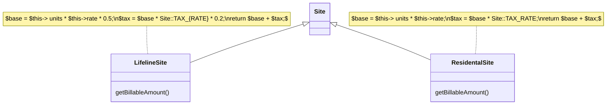
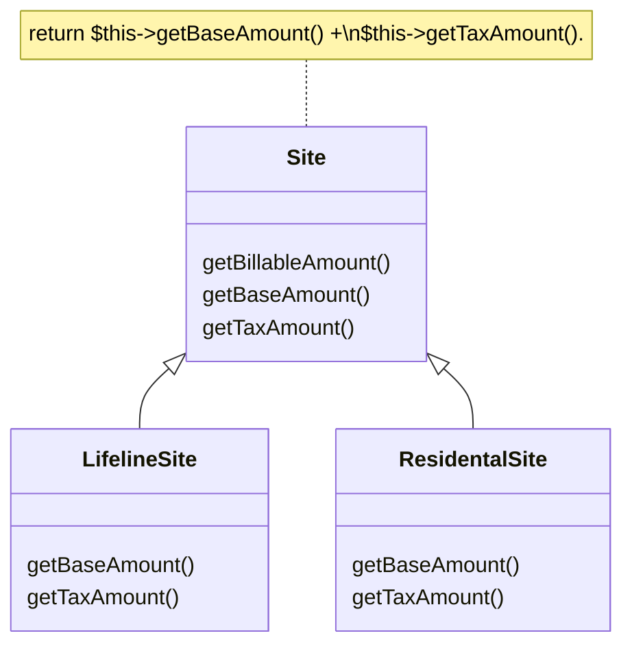

# Form Template Method

### Problem

Your subclasses implement algorithms that contain similar steps in the same order.

### Solution

Move the algorithm structure and identical steps to a superclass, and leave implementation of the different steps in the subclasses.

### Why Refactor

Subclasses are developed in parallel, sometimes by different people,
which leads to code duplication, errors, and difficulties in code
maintenance, since each change must be made in all subclasses.

### Benefits

-   Code duplication doesn't always refer to cases of simple copy/paste.
    Often duplication occurs at a higher level, such as when you have a
    method for sorting numbers and a method for sorting object
    collections that are differentiated only by the comparison of
    elements. Creating a template method eliminates this duplication by
    merging the shared algorithm steps in a superclass and leaving just
    the differences in the subclasses.

-   Forming a template method is an example of the *Open/Closed
    Principle* in action. When a new algorithm version appears, you need
    only to create a new subclass; no changes to existing code are
    required.

### How to Refactor

1.  Split algorithms in the subclasses into their constituent parts
    described in separate methods. [Extract Method](/extract-method) can
    help with this.

2.  The resulting methods that are identical for all subclasses can be
    moved to a superclass via [Pull Up Method](/pull-up-method).

3.  The non-similar methods can be given consistent names via [Rename
    Method](/rename-method).

4.  Move the signatures of non-similar methods to a superclass as
    abstract ones by using [Pull Up Method](/pull-up-method). Leave
    their implementations in the subclasses.

5.  And finally, pull up the main method of the algorithm to the
    superclass. Now it should work with the method steps described in
    the superclass, both real and abstract.
