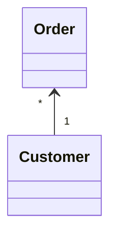
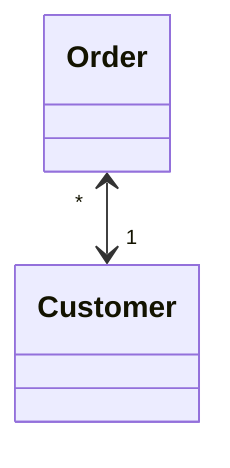

# Change Unidirectional Association to Bidirectional

### Problem

You have two classes that each need to use the features of the other,
but the association between them is only unidirectional.

### Solution

Add the missing association to the class that needs it.

### Why Refactor

Originally the classes had a unidirectional association. But with time,
client code needed access to both sides of the association.

### Benefits

-   If a class needs a reverse association, you can simply calculate it.
    But if these calculations are complex, it's better to keep the
    reverse association.

### Drawbacks

-   Bidirectional associations are much harder to implement and maintain
    than unidirectional ones.

-   Bidirectional associations make classes interdependent. With a
    unidirectional association, one of them can be used independently of
    the other.

### How to Refactor

1.  Add a field for holding the reverse association.

2.  Decide which class will be "dominant". This class will contain the
    methods that create or update the association as elements are added
    or changed, establishing the association in its class and calling
    the utility methods for establishing the association in the
    associated object.

3.  Create a utility method for establishing the association in the
    "non-dominant" class. The method should use what it's given in
    parameters to complete the field. Give the method an obvious name so
    that it isn't used later for any other purposes.

4.  If old methods for controlling the unidirectional association were
    in the "dominant" class, complement them with calls to utility
    methods from the associated object.

5.  If the old methods for controlling the association were in the
    "non-dominant" class, create the methods in the "dominant" class,
    call them, and delegate execution to them.
