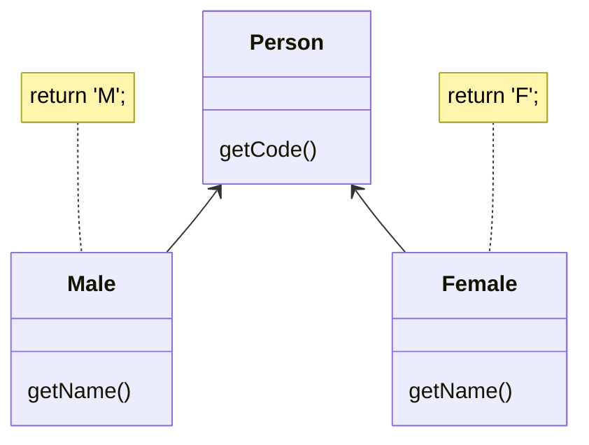
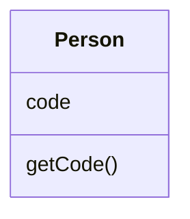

# Replace Subclass with Fields

### Problem

You have subclasses differing only in their (constant-returning)
methods.

### Solution

Replace the methods with fields in the parent class and delete the subclasses.

### Why Refactor

Sometimes refactoring is just the ticket for avoiding type code.

In one such case, a hierarchy of subclasses may be different only in the values returned by particular methods. These methods aren't even the result of computation, but are strictly set out in the methods themselves or in the fields returned by the methods. To simplify the class architecture, this hierarchy can be compressed into a single class containing one or several fields with the necessary values, based on the situation.

These changes may become necessary after moving a large amount of functionality from a class hierarchy to another place. The current hierarchy is no longer so valuable and its subclasses are now just dead weight.

### Benefits

-  Simplifies system architecture. Creating subclasses is overkill if all you want to do is to return different values in different methods.

### How to Refactor

1.  Apply [[fruit/Coding/Refactoring/simplifying-method-calls/replace-constructor-with-factory-method|Replace Constructor with Factory Method]] to the subclasses.

2.  Replace subclass constructor calls with superclass factory method calls.

3.  In the superclass, declare fields for storing the values of each of the subclass methods that return constant values.

4.  Create a protected superclass constructor for initializing the new fields.

5.  Create or modify the existing subclass constructors so that they call the new constructor of the parent class and pass the relevant values to it.

6.  Implement each constant method in the parent class so that it returns the value of the corresponding field. Then remove the method from the subclass.

7.  If the subclass constructor has additional functionality, use
    [[fruit/Coding/Refactoring/composing-methods/inline-method|Inline Method]] to incorporate the constructor into the superclass factory method.

8.  Delete the subclass.
