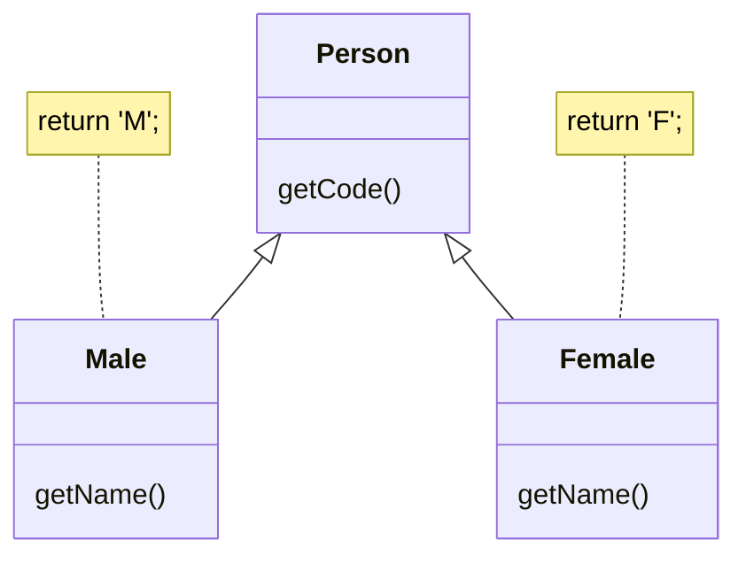
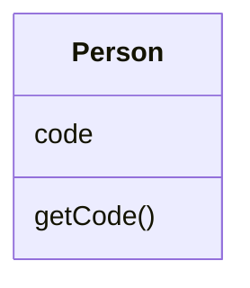

# Replace Type Code with Subclasses

> **What's type code?** Type code occurs when, instead of a separate data type, you have a set of numbers or strings that form a list of allowable values for some entity. Often these specific numbers and strings are given understandable names via constants, which is the reason for why such type code is encountered so much.

### Problem

You have a coded type that directly affects program behavior (values of this field trigger various code in conditionals).

### Solution

Create subclasses for each value of the coded type. Then extract the relevant behaviors from the original class to these subclasses. Replace the control flow code with polymorphism.

### Why Refactor

This refactoring technique is a more complicated twist on  [[fruit/Coding/Refactoring/organizing-data/replace-type-code-with-class|Replace Type Code With Class]].

As in the first refactoring method, you have a set of simple values that constitute all the allowed values for a field. Although these values are often specified as constants and have understandable names, their use makes your code very error-prone since they're still primitives in effect. For example, you have a method that accepts one of these values in the parameters. At a certain moment, instead of the constant
`USER_TYPE_ADMIN` with the value `"ADMIN"`, the method receives the same string in lower case (`"admin"`), which will cause execution of something else that the author (you) didn't intend.

Here we're dealing with control flow code such as the conditionals `if`, `switch` and `?:`. In other words, fields with coded values (such as `$user->type === self::USER_TYPE_ADMIN`) are used inside the conditions of these operators. If we were to use [Replace Type Code with Class](/replace-type-code-with-class) here, all these control flow
constructions would be best moved to a class responsible for the data type. Ultimately, this would of course create a type class very similar to the original one, with the same problems as well.

### Benefits

-   Delete the control flow code. Instead of a bulky `switch` in the original class, move the code to appropriate subclasses. This improves adherence to the *Single Responsibility Principle* and makes the program more readable in general.

-   If you need to add a new value for a coded type, all you need to do is add a new subclass without touching the existing code (cf. the *Open/Closed Principle*).

-   By replacing type code with classes, we pave the way for type hinting for methods and fields at the level of the programming language. This wouldn't be possible using simple numeric or string values contained in a coded type.

### When Not to Use

-   This technique isn't applicable if you already have a class
    hierarchy. You can't create a dual hierarchy via inheritance in
    object-oriented programming. Still, you can replace type code via composition instead of inheritance. To do so, use [[fruit/Coding/Refactoring/organizing-data/replace-type-code-with-state-strategy|Replace Type Code With State/Strategy]]. 

-   If the values of type code can change after an object is created, avoid this technique. We would have to somehow replace the class of the object itself on the fly, which isn't possible. Still, an alternative in this case too would be [[fruit/Coding/Refactoring/organizing-data/replace-type-code-with-state-strategy|Replace Type Code With State/Strategy]]. 

### How to Refactor

1.  Use [[fruit/Coding/Refactoring/organizing-data/self-encapsulate-field|Self Encapsulate Field]] to create a getter for the field that contains type code.

2.  Make the superclass constructor private. Create a static factory method with the same parameters as the superclass constructor. It must contain the parameter that will take the starting values of the coded type. Depending on this parameter, the factory method will create objects of various subclasses. To do so, in its code you must create a large conditional but, at least, it'll be the only one when it's truly necessary; otherwise, subclasses and polymorphism will do.

3.  Create a unique subclass for each value of the coded type. In it, redefine the getter of the coded type so that it returns the corresponding value of the coded type.

4.  Delete the field with type code from the superclass. Make its getter abstract.

5.  Now that you have subclasses, you can start to move the fields and methods from the superclass to corresponding subclasses (with the help of [[fruit/Coding/Refactoring/dealing-with-generalization/push-down-field|Push Down Field]] and [[fruit/Coding/Refactoring/dealing-with-generalization/push-down-method|Push Down Method]]).

6.  When everything possible has been moved, use [[fruit/Coding/Refactoring/simplifying-conditional-expressions/replace-conditional-with-polymorphism|Replace Conditional With Polymorphism]] in order to get rid of conditions that use the type code once and for all.
