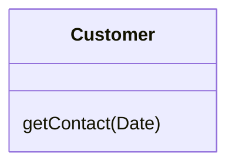
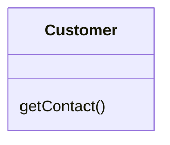

# Remove Parameter

### Problem

A parameter isn't used in the body of a method.

### Solution

Remove the unused parameter.

### Why Refactor

Every parameter in a method call forces the programmer reading it to figure out what information is found in this parameter. And if a parameter is entirely unused in the method body, this "noggin scratching" is for naught.

And in any case, additional parameters are extra code that has to be run.

Sometimes we add parameters with an eye to the future, anticipating changes to the method for which the parameter might be needed. All the same, experience shows that it's better to add a parameter only when it's genuinely needed. After all, anticipated changes often remain just that---anticipated.

### Benefits

-   A method contains only the parameters that it truly requires.

### When Not to Use

-   If the method is implemented in different ways in subclasses or in a superclass, and your parameter is used in those implementations, leave the parameter as-is.

### How to Refactor

1.  See whether the method is defined in a superclass or subclass. If so, is the parameter used there? If the parameter is used in one of these implementations, hold off on this refactoring technique.

2.  The next step is important for keeping the program functional during the refactoring process. Create a new method by copying the old one and delete the relevant parameter from it. Replace the code of the old method with a call to the new one.

3.  Find all references to the old method and replace them with
    references to the new method.

4.  Delete the old method. Don't perform this step if the old method is part of a public interface. In this case, mark the old method as deprecated.
