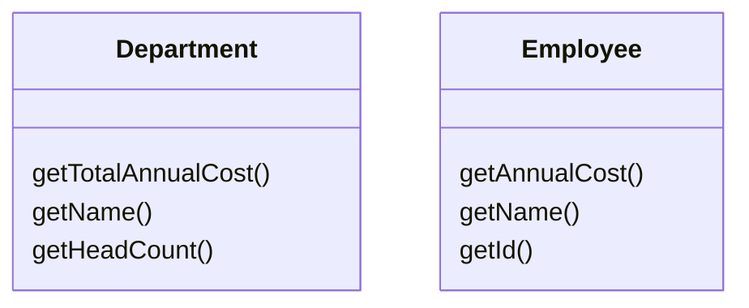
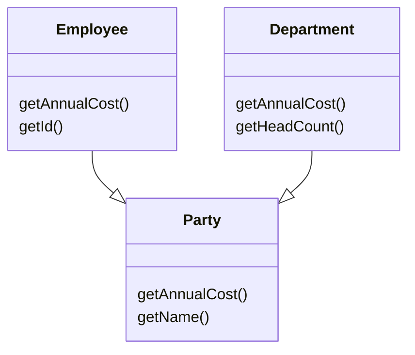

# Extract Superclass

### Problem

You have two classes with common fields and methods.

### Solution

Create a shared superclass for them and move all the identical fields and methods to it.
 

### Why Refactor

One type of code duplication occurs when two classes perform similar tasks in the same way, or perform similar tasks in different ways. Objects offer a built-in mechanism for simplifying such situations via inheritance. But oftentimes this similarity remains unnoticed until classes are created, necessitating that an inheritance structure be created later.

### Benefits
- Code deduplication. Common fields and methods now "live" in one place only.

### When Not to Use

- You can not apply this technique to classes that already have a superclass.

### How to Refactor

1. Create an abstract superclass.

2. Use [[fruit/Coding/Refactoring/techniques/dealing-with-generalization/pull-up-field|Pull Up Field]], [[fruit/Coding/Refactoring/techniques/dealing-with-generalization/pull-up-method|Pull Up Method]], and [[fruit/Coding/Refactoring/techniques/dealing-with-generalization/pull-up-constructor-body|Pull Up Constructor Body]] to move the common functionality to a superclass. Start with the fields, since in addition to the common fields you will need to move the fields that are used in the common methods.

3. Look for places in the client code where use of subclasses can be replaced with your new class (such as in type declarations).
