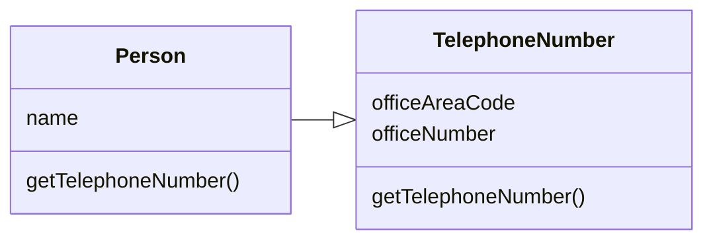
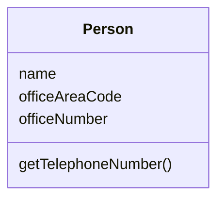

# Inline Class

### Problem

A class does almost nothing and isn't responsible for anything, and no additional responsibilities are planned for it.

### Solution

Move all features from the class to another one.

### Why Refactor

- Often this technique is needed after the features of one class are "transplanted" to other classes, leaving that class with little to do.

### Benefits

- Eliminating needless classes frees up operating memory on the computer---and bandwidth in your head.

### How to Refactor

1. In the recipient class, create the public fields and methods present in the donor class. Methods should refer to the  quivalent methods of the donor class.

2. Replace all references to the donor class with references to the fields and methods of the recipient class.

3. Now test the program and make sure that no errors have been added. If tests show that everything is working A-OK, start using [[fruit/Coding/Refactoring/techniques/moving-features-between-objects/move-method|Move Method]] and [[fruit/Coding/Refactoring/techniques/moving-features-between-objects/move-field|Move Field]] to completely transplant all functionality to the recipient class from the original one. continue doing so until the original class is completely empty.

4. Delete the original class.
