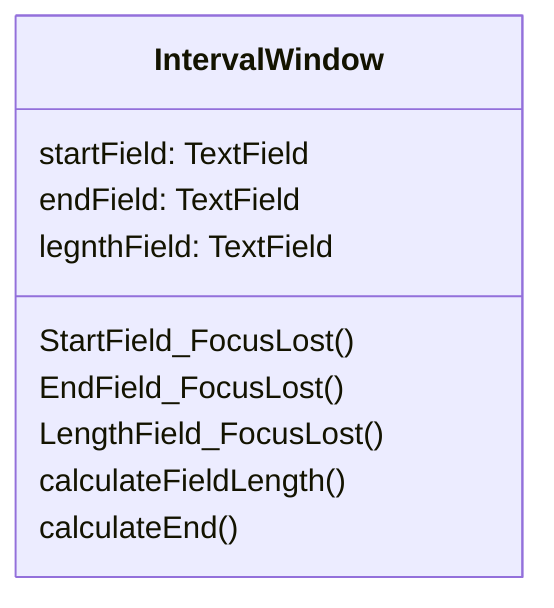
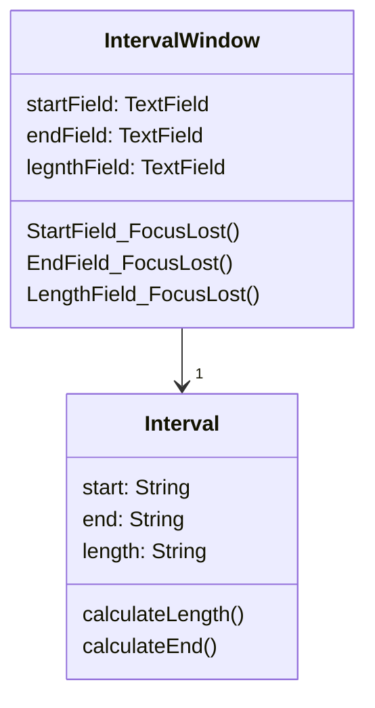

# Duplicate Observed Data

### Problem

Is domain data stored in classes responsible for the GUI?

### Solution

Then it's a good idea to separate the data into separate classes,
ensuring connection and synchronization between the domain class and the GUI.

### Why Refactor

You want to have multiple interface views for the same data (for
example, you have both a desktop app and a mobile app). If you fail to separate the GUI from the domain, you will have a very hard time avoiding code duplication and a large number of mistakes.

### Benefits

- You split responsibility between business logic classes and presentation classes (cf. the *Single Responsibility Principle*), which makes your program more readable and understandable.

- If you need to add a new interface view, create new presentation classes; you don't need to touch the code of the business logic (cf. the *Open/Closed Principle*).

- Now different people can work on the business logic and the user interfaces.

### When Not to Use

- This refactoring technique, which in its classic form is performed using the [[fruit/Coding/Patterns/Design Patterns/catalog/behavioral/observer|Observer]] template, isn't applicable for web apps, where all classes are recreated between queries to the web server.

- All the same, the general principle of extracting business logic into separate classes can be justified for web apps as well. But this will be implemented using different refactoring techniques depending on how your system is designed.

### How to Refactor

1. Hide direct access to domain data in the *GUI class*. For this, it's best to use [[fruit/Coding/Refactoring/techniques/organizing-data/self-encapsulate-field|Self Encapsulate Field]]. So you create the getters and setters for this data.

2. In handlers for *GUI class* events, use setters to set new field values. This will let you pass these values to the associated *domain object*.

3. Create a domain class and copy necessary fields from the *GUI class* to it. Create getters and seters for all these fields.

4. Create an Observer pattern for these two classes:

    - In the *domain class*, create an array for storing observer
        objects (*GUI objects*), as well as methods for registering,
        deleting and notifying them.

    - In the *GUI class*, create a field for storing references to the
        *domain class* as well as the `update()` method, which will be reacting to changes in the object and update the values of fields in the *GUI class*. Note that value updates should be established directly in the method, in order to avoid recursion.

    - In the *GUI class* constructor, create an instance of *domain
        class* and save it in the field you have created. Register the
        *GUI object* as an observer in the *domain object*.

    - In the setters for *domain class* fields, call the method for
        notifying the observer (in other words, method for updating in the *GUI class*), in order to pass the new values to the GUI.

    - Change the setters of the *GUI class* fields so that they set
        new values in the domain object directly. Watch out to make sure that values aren't set through a *domain class*
        setter---otherwise infinite recursion will result.
