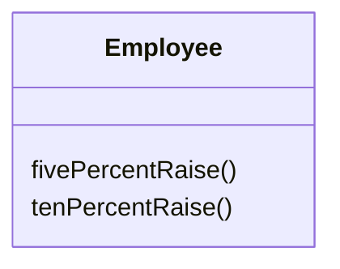
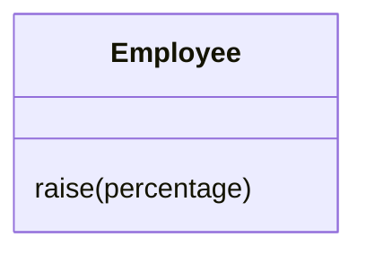

# Parameterize Method

### Problem

Multiple methods perform similar actions that are different only in their internal values, numbers or operations.

### Solution

Combine these methods by using a parameter that will pass the necessary special value.

### Why Refactor

If you have similar methods, you probably have duplicate code, with all the consequences that this entails.

What's more, if you need to add yet another version of this
functionality, you will have to create yet another method. Instead, you could simply run the existing method with a different parameter.

### Drawbacks

- Sometimes this refactoring technique can be taken too far, resulting in a long and complicated common method instead of multiple simpler ones.

- Also be careful when moving activation/deactivation of functionality to a parameter. This can eventually lead to creation of a large conditional operator that will need to be treated via [[fruit/Coding/Refactoring/techniques/simplifying-method-calls/replace-parameter-with-explicit-methods|Replace Parameter with Explicit Methods]].

### How to Refactor

1. Create a new method with a parameter and move it to the code that's the same for all classes, by applying [[fruit/Coding/Refactoring/techniques/composing-methods/extract-method|Extract Method]]. Note that sometimes only a certain part of methods is actually the same. In this case, refactoring consists of extracting only the same part to a new method.

2. In the code of the new method, replace the special/differing value with a parameter.

3. For each old method, find the places where it's called, replacing these calls with calls to the new method that include a parameter. Then delete the old method.
