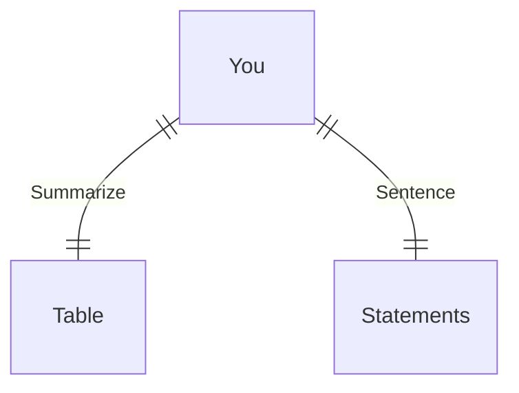

---
# configs for document itself.
title: "🎉Tools for work"
lastModified: "2022-12-22"

# field for querying only entry point notes.
isEntryPoint: true

# add some tags for specifying particular subjects.
tags:
  - "entrypoint"
  - "toolsForWork"
---
# TL;DR
- you can summarize contents as a table format.
- or just write down statements you think it is important within 3 lines.

# Map of contents
- Draw a simple excalidraw scatch to understand how contents are constructed and networked.

# Features
- List up frequently used features.
- [[Design/Seeds/Shovel/Tools for work/Photoshop/🎉Photoshop|🎉Photoshop]]
- 

# Issues
- what design patterns adapated to each features.
- how to pipe logics to build features.
- challenges during implementing features.
- helpful supports deserve to remember.
- Glean tips using `mindulle-cli` for digital gardening.

# Showcases
- construct visual gallery to summarize your expriences.

# Adobe
## Photoshop
- [Adobe beginner](https://www.adobe.com/kr/lead/creativecloud/adobe-game.html)

## Illustrator
## Aftereffect
## Figma

# Airbnb
## Lottie

# Protofie
# Framer