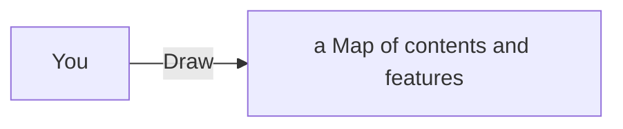

---
# configs for document itself.
title: "🎉Useful sites"
lastModified: "2023-01-15"

# field for querying only entry point notes.
isEntryPoint: true

# add some tags for specifying particular subjects.
tags:
  - "entrypoint"
---
# Map of contents

- [[Design/Seeds/Shovel/Useful sites/Auto Painter/🎉Auto Painters|🎉Auto Painters]]
- [[Design/Seeds/Shovel/Useful sites/Generators/🎉Generators|🎉Generators]]
- [[Design/Seeds/Shovel/Useful sites/Fonts/🎉Fonts|🎉Fonts]]

# Features
- List up frequently used features.

# Issues
- what design patterns adapated to each features.
- how to pipe logics to build features.
- challenges during implementing features.
- helpful supports deserve to remember.
- Glean tips using `mindulle-cli` for digital gardening.

# Showcases
- construct visual gallery to summarize your expriences.
