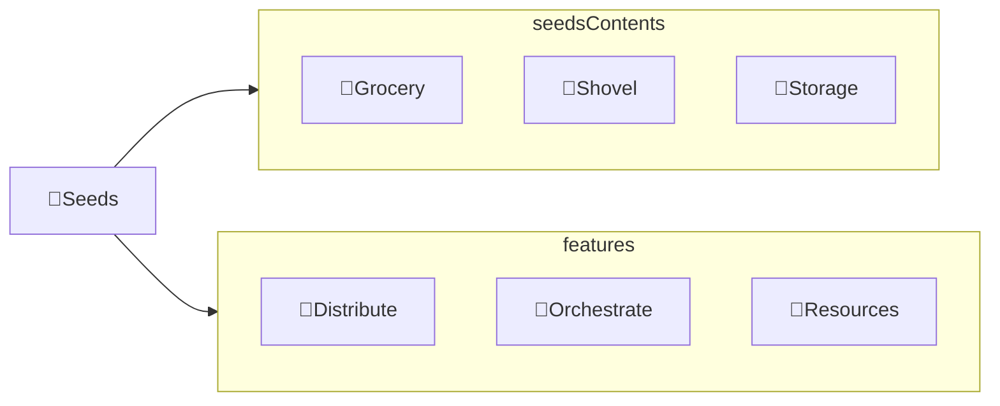

---
# configs for document itself.
title: "🎉Seeds"
lastModified: "2022-12-16"

# field for querying only entry point notes.
isEntryPoint: true

# add some tags for specifying particular subjects.
tags:
  - "entrypoint"
  - "seed"
---
# TL;DR
- you can summarize contents as a table format.
- or just write down statements you think it is important within 3 lines.

# Map of contents

- [[Design/Seeds/Storage/🎉Storage|🎉Storage]]
- [[Design/Seeds/Shovel/🎉Shovel|🎉Shovel]]
- [[Design/Seeds/Grocery/🎉Grocery|🎉Grocery]]

# Features
- List up frequently used features.
- [[Design/Seeds/🌱Distribute|🌱Distribute]]
- [[Design/Seeds/🎻Orchestrate|🎻Orchestrate]]
- [[Design/Seeds/🚚Resources|🚚Resources]]

# Issues
- what design patterns adapated to each features.
- how to pipe logics to build features.
- challenges during implementing features.
- helpful supports deserve to remember.
- Glean tips using `mindulle-cli` for digital gardening.

# Showcases
- construct visual gallery to summarize your expriences.

# See also
- Further readings