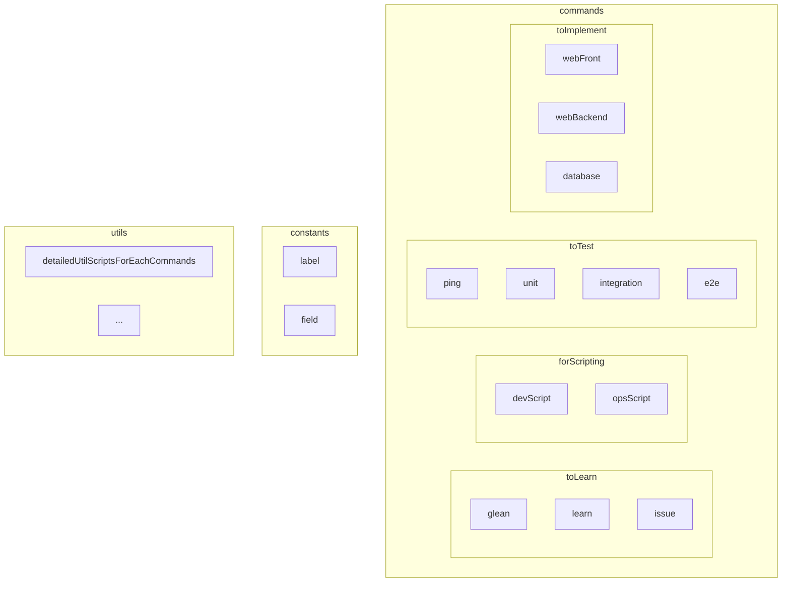

# Manage seed
## UI sktech
### case 1 : SeedType 선택 전
| ID       | Title         | URL             | SeedType |
| -------- | ------------- | --------------- | -------- |
| smallint | varchar[(48)] | varchar[(2084)] | enum('Grocery', 'Shovel', 'Storage') 

### case 2 : SeedType 선택 후
#### case 2 - 1 : Storage 선택
| SeedType                             | Content type |
| ------------------------------------ | ------------ |
| enum('Grocery', 'Shovel', 'Storage') | enum('capture', 'credible', 'idea', 'issue')             |
- 를 생성하고 join합니다.

#### case 2 - 2 : Grocery 선택
| SeedType                             | ROLE                   | MINE                                                    | TYPE                                |
| ------------------------------------ | ---------------------- | ------------------------------------------------------- | ----------------------------------- |
| enum('Grocery', 'Shovel', 'Storage') | enum('db', 'be', 'fe') | enum('gql', 'pql', 'fastAPI', 'react', 'vanlia', 'vue') | enum('usg', 'tip', 'snpt', 'demo', 'cli') |
- 를 생성하고 join합니다.

#### Case 2 -3 : Shovel 선택
| SeedType                             | ROLE                                     | TOOL        | MINE                                |
| ------------------------------------ | ---------------------------------------- | ----------- | ----------------------------------- |
| enum('Grocery', 'Shovel', 'Storage') | enum('mngRc', 'search', 'tools', 'asst') | enum('zsh') | enum('usg', 'tip', 'docs', 'note') |
- 를 생성하고 join합니다.

# Diagrams
## flowcharts

> [!tip] Mermaid.js로 FlowChart 그리기
> [[Develop/Trees/Dev/Programming/Libs&Fwks/By subject/Diagraming/mermaid.js/contents/Diagram Syntax/Flowchart#Subgraphs 🎯⭐|Flowchart#Subgraphs 🎯⭐]] 를 이용하면 플로우 차트를 섹션별로 나누어 그릴 수 있다!


```mermaid
flowchart LR
	
```
## ERD
> [!tip] Mermaid.js로 ERD 그리기
> [[Develop/Trees/Dev/Programming/Libs&Fwks/By subject/Diagraming/mermaid.js/contents/Diagram Syntax/Entity Relationship Diagram#Attributes 🎯⭐|Entity Relationship Diagram#Attributes 🎯⭐]]를 이용하면 개념적 데이터 모델링, 논리적 데이터 모델링을 한번에 할 수 있다.
```mermaid
erDiagram
	
```

## Query
