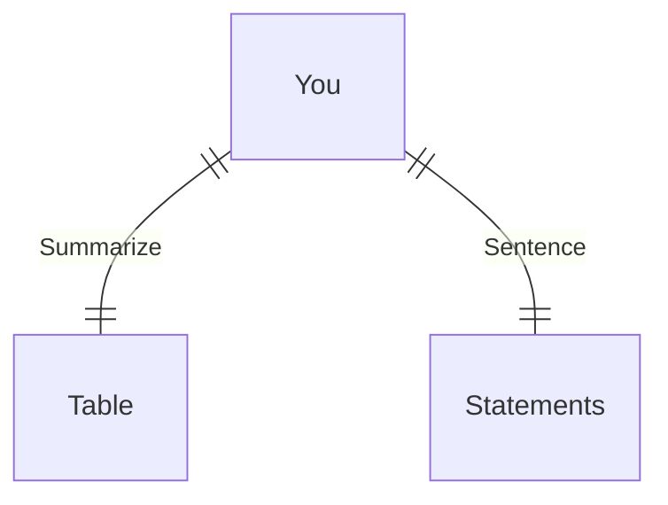

---
# configs for document itself.
title: "🎉packages"
lastModified: "2022-12-17"

# field for querying only entry point notes.
isEntryPoint: true

# add some tags for specifying particular subjects.
tags:
  - "entrypoint"
  - "mindulle/packages"
---
```toc
style: bullet
```

# TL;DR
- you can summarize contents as a table format.
- or just write down statements you think it is important within 3 lines.



# Map of contents
- Draw a simple excalidraw scatch to understand how contents are constructed and networked.

# Features
- List up frequently used features.

# Issues
- what design patterns adapated to each features.
- how to pipe logics to build features.
- challenges during implementing features.
- helpful supports deserve to remember.
- Glean tips using `mindulle-cli` for digital gardening.

# Showcases
- construct visual gallery to summarize your expriences.

# 이 프로젝트의 구조
```
|--- docs : vitepress docs
|--- packages
|    |--- UI
|         |--- components
|              |--- Vanilla
|              |--- React
|              |--- Vue
|         |--- helpers
|              |--- vanilla
|              |--- React
|              |--- Vue
|    |--- knowledge-bases
|         |--- data-structure
|         |--- algorithms
|         |--- resources
|    |--- scripts
|         |--- Shell
|         |--- Docker
|         |--- nodeEnvs?
|         |--- Actions
|         |--- further more...
```

# 저장소 클론뜨기 및 깃 설정 mindulle로 돌려놓기
```shell
git clone https://github.com/mindulle/packages.git
git config --local user.name "mindulle"
git config --local user.email "mindullestudio@gmail.com"
```
# 시작하기
```shell
npx lerna init
```

## 만든 저장소에 vitepress 패키지 설치하기
```shell
yarn add --dev vitepress vue
```

## packages 폴더에서 vite를 이용해 npm 모듈 작성하기
```shell
yarn create vite
```
- 명령어 실행 후 아래 작업 수행하기
	- [ ] 모듈 이름 짓기 : @mindulle/packages/MOUDLE_NAME
	- [ ]  프레임워크 선택하기 : Others -  Create-vite-extra - library(거의 제일 아래) - library ts
	- [ ] 브랜치 나누고 루트 디렉토리에 액션으로 빌드 & 배포 자동화하기(lerna publish 등)
	- Vscode에서 본격적인 모듈 작업하기.
		- [ ] 의존성 설치 (yarn)
		- [ ] 세 개의 설정파일(vite.config.js, package.json, tsconfig.json)에서 모듈 이름이나 컴파일 설정 등을 알맞게 수정
		- [ ] 이슈 생성하기
		- [ ] 모듈 구현하기
		- [ ] 커밋 쌓기
		- [ ] 커밋이 충분히 쌓였으면 이슈에 알맞은 풀리퀘 생성하기
		- [ ] 풀리퀘 검토하고 머지하기
	- [ ] 모듈 작업 후 vitepress 문서 업데이트하기.