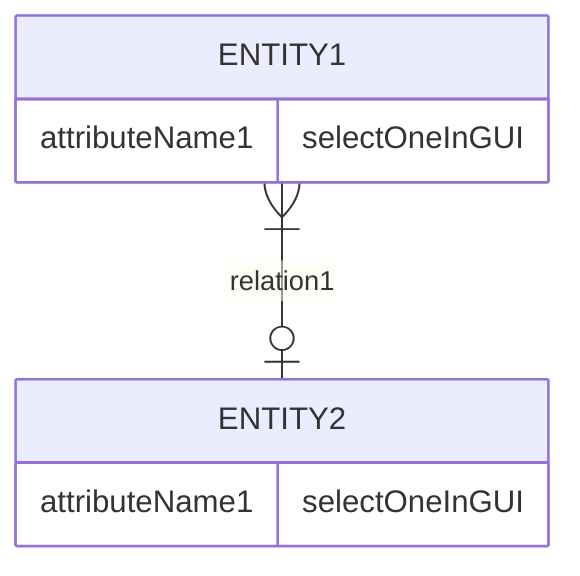

# 0. 의 과정에서 열거한 Entity, Attributes, Relation를 모두 복사 붙여넣기 한 뒤 mermaid로 ER Diagram 그리기

```mermaid
erDiagram
	ENTITY1 }|--o| ENTITY2 : relation1
	ENTITY1 {
		attributeName1 selectOneInGUI
	}
	ENTITY2 {
		attributeName1 selectOneInGUI
	}
```