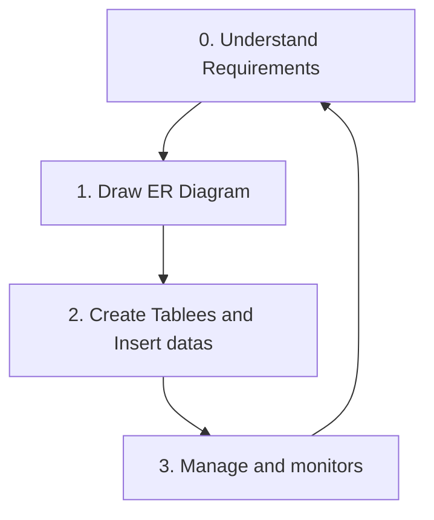

---
# configs for document itself.
title: "🎉construction"
lastModified: "2023-01-08"

# field for querying only entry point notes.
isEntryPoint: true

# add some tags for specifying particular subjects.
tags:
  - "entrypoint"
---
# TL;DR
- you can summarize contents as a table format.
- or just write down statements you think it is important within 3 lines.

# Map of contents

# Features
- [[Develop/Seeds/(Destructure this)Grocery/Database/construction/0. Understand Requirements|0. Understand Requirements]]
- [[Develop/Seeds/(Destructure this)Grocery/Database/construction/1. Draw ER Diagram|1. Draw ER Diagram]]
- [[Develop/Seeds/(Destructure this)Grocery/Database/construction/2. Create Tables and Insert datas|2. Create Tables and Insert datas]]
- [[Develop/Seeds/(Destructure this)Grocery/Database/construction/3. Manage and monitors|3. Manage and monitors]]

# Issues
- what design patterns adapated to each features.
- how to pipe logics to build features.
- challenges during implementing features.
- helpful supports deserve to remember.
- Glean tips using `mindulle-cli` for digital gardening.

# Showcases
- construct visual gallery to summarize your expriences.
