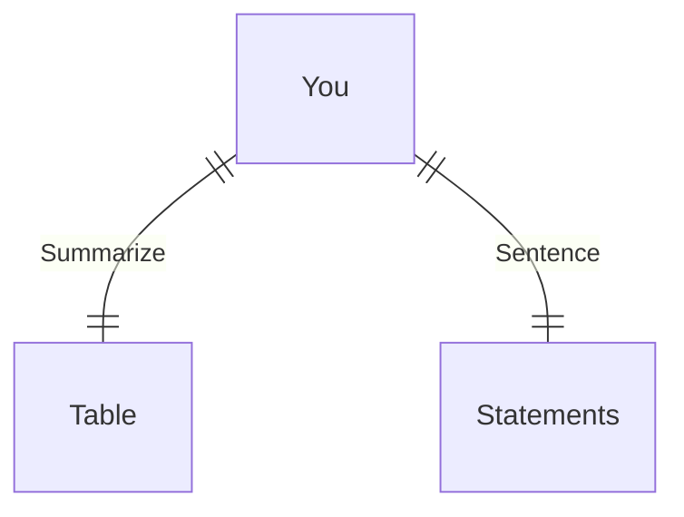

---
# configs for document itself.
title: "🎉docker"
lastModified: "2022-12-27"

# field for querying only entry point notes.
isEntryPoint: true

# add some tags for specifying particular subjects.
tags:
  - "entrypoint"
---
```toc
style: bullet
```

# TL;DR
- you can summarize contents as a table format.
- or just write down statements you think it is important within 3 lines.



# Map of contents
- Draw a simple excalidraw scatch to understand how contents are constructed and networked.
- [[Develop/Seeds/Grocery/Configurations/Docker/Settings/_Settings|_Settings]]

# Features
- List up frequently used features.
- [[Develop/Seeds/Grocery/Configurations/Docker/🚚Resources|🚚Resources]]

# Issues
- what design patterns adapated to each features.
- how to pipe logics to build features.
- challenges during implementing features.
- helpful supports deserve to remember.
- Glean tips using `mindulle-cli` for digital gardening.

# Showcases
- construct visual gallery to summarize your expriences.
# See also
- https://learn.microsoft.com/ko-kr/training/modules/use-docker-container-dev-env-vs-code/