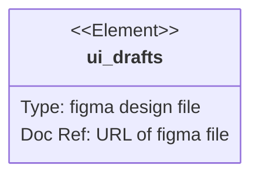

# Requirements diagram의 UI 시안 확인하기

# 시안 보면서 페이지별 Enity, Attributes, Relation 목록을 열거하기
## PageName1
### Entities
- ENTITY1
- ENTITY2
- ...

### Attributes
- ENTITY1
	- attributeName1  selectOneInGUI

- ENTITY2
	- attributeName1  selectOneInGUI

### Relations
- ENTITY1 }|--o| ENTITY2 : relation1
- ...