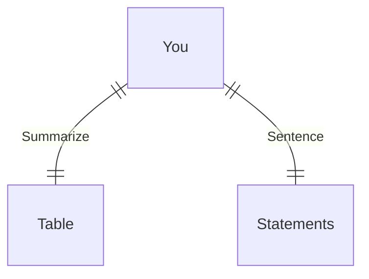

---
# configs for document itself.
title: "🎉Database"
lastModified: "2022-12-25"

# field for querying only entry point notes.
isEntryPoint: true

# add some tags for specifying particular subjects.
tags:
  - "entrypoint"
  - "database"
---
```toc
style: bullet
```

# TL;DR
- you can summarize contents as a table format.
- or just write down statements you think it is important within 3 lines.



# Map of contents
- Draw a simple excalidraw scatch to understand how contents are constructed and networked.
- [[Develop/Seeds/Grocery/Database/Graphql/🎉Graphql|🎉Graphql]]
- [[Develop/Seeds/Grocery/Database/PostgreSQL/🎉PostgreSQL|🎉PostgreSQL]]
- [[Develop/Seeds/Grocery/Database/Redis/🎉Redis|🎉Redis]]

# Features
- List up frequently used features.
- [[Develop/Seeds/Grocery/Database/🐝Buzzwords|🐝Buzzwords]]
- [[Develop/Seeds/Grocery/Database/📚Dictionary|📚Dictionary]]
- [[Develop/Seeds/Grocery/Database/🚚Resources|🚚Resources]]

# Issues
- what design patterns adapated to each features.
- how to pipe logics to build features.
- challenges during implementing features.
- helpful supports deserve to remember.
- Glean tips using `mindulle-cli` for digital gardening.

# Showcases
- construct visual gallery to summarize your expriences.
