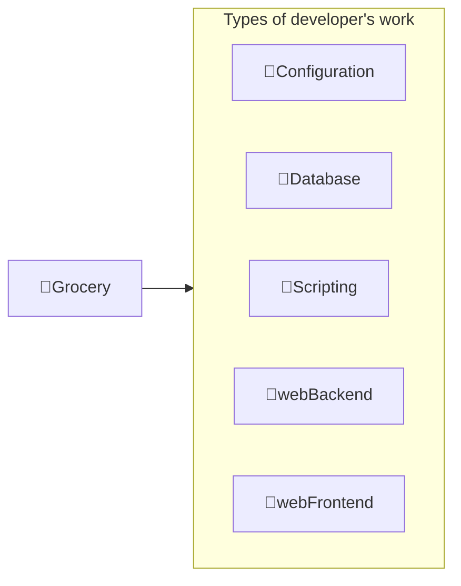

---
# configs for document itself.
title: "🎉Grocery"
lastModified: "2022-12-25"

# field for querying only entry point notes.
isEntryPoint: true

# add some tags for specifying particular subjects.
tags:
  - "entrypoint"
---
```toc
style: bullet
```

# TL;DR
- Grocery는 주요 학습 개념 중 내가 사용해보고 경험해 본 씨앗만 모아두는 역할을 합니다.

# Map of contents

- [[Develop/Seeds/Grocery/Configurations/🎉Configurations|🎉Configuration]]
- [[Develop/Seeds/Grocery/Database/🎉Database|🎉Database]]
- [[Develop/Seeds/Grocery/Scripting/🎉Scripting|🎉Scripting]]
- [[Develop/Seeds/Grocery/WebBackend/🎉WebBackend|🎉webBackend]]
- [[Develop/Seeds/Grocery/WebFrontend/🎉WebFrontend|🎉webFrontend]]

# Features
- List up frequently used features.

# Issues
- what design patterns adapated to each features.
- how to pipe logics to build features.
- challenges during implementing features.
- helpful supports deserve to remember.
- Glean tips using `mindulle-cli` for digital gardening.

# Showcases
- construct visual gallery to summarize your expriences.
