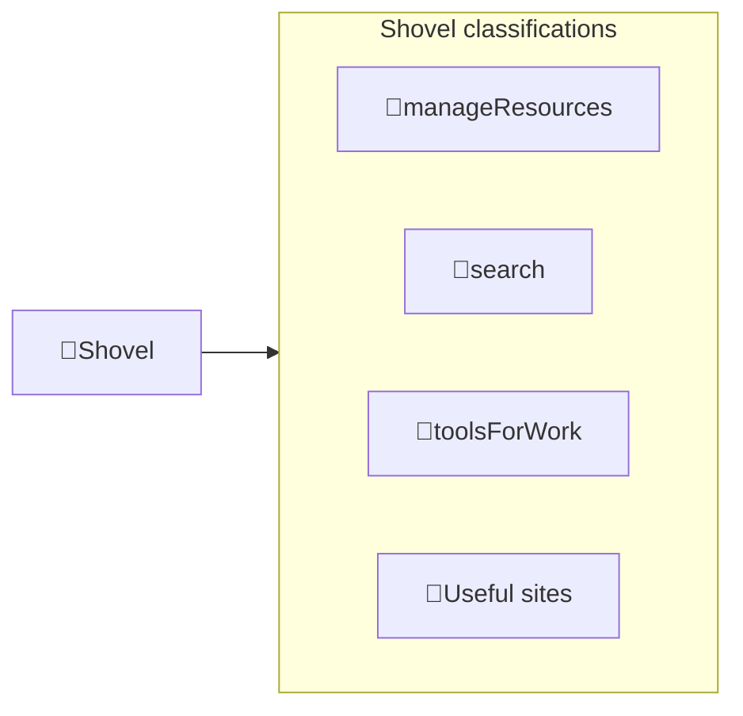

---
# configs for document itself.
title: "🎉Shovel"
lastModified: "2022-12-14"

# field for querying only entry point notes.
isEntryPoint: true

# add some tags for specifying particular subjects.
tags:
  - "entrypoint"
  - "shovel"
---
# TL;DR
- you can summarize contents as a table format.
- or just write down statements you think it is important within 3 lines.

# Map of contents

- [[Develop/Seeds/Shovel/My workflow/🎉My workflow|🎉My workflow]] : 작업 순서를 mermaid나 excalidraw로 그려놓고 디테일을 보기위한 로컬용 캔버스 그려두기
- [[Develop/Seeds/Shovel/Tools/🎉Tools|🎉Tools]] : 주요 개발 도구들(obisidian, vscode) 뿐만 아니라 자잘한 기능을 위해 사용되는 사이트들(아이콘, css sprite, 컬러 생성기 등. raindrop에 보관)이 어떻게 관리되고 어디에 저장되어 있는지 기록하기.

# Features
- List up frequently used features.

# Issues
- what design patterns adapated to each features.
- how to pipe logics to build features.
- challenges during implementing features.
- helpful supports deserve to remember.
- Glean tips using `mindulle-cli` for digital gardening.

# Showcases
- construct visual gallery to summarize your expriences.

# See also
