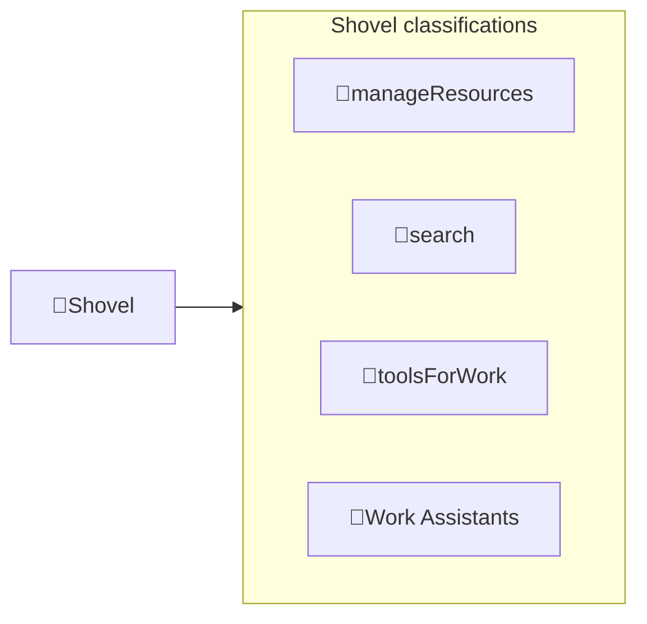

---
# configs for document itself.
title: "🎉Shovel"
lastModified: "2022-12-14"

# field for querying only entry point notes.
isEntryPoint: true

# add some tags for specifying particular subjects.
tags:
  - "entrypoint"
  - "shovel"
---
# TL;DR
- you can summarize contents as a table format.
- or just write down statements you think it is important within 3 lines.

# Map of contents

- [[Develop/Seeds/Shovel/Manage resources/🎉Manage resources||🎉Manage resources]]
- [[Develop/Seeds/Shovel/Search/🎉Search|🎉Search]]
- [[Develop/Seeds/Shovel/Tools for work/🎉Tools for work|🎉Tools for work]]
- [[Develop/Seeds/Shovel/Work Assistants/🎉Work Assistants|🎉Work Assistants]]

# Features
- List up frequently used features.

# Issues
- what design patterns adapated to each features.
- how to pipe logics to build features.
- challenges during implementing features.
- helpful supports deserve to remember.
- Glean tips using `mindulle-cli` for digital gardening.

# Showcases
- construct visual gallery to summarize your expriences.

# See also
