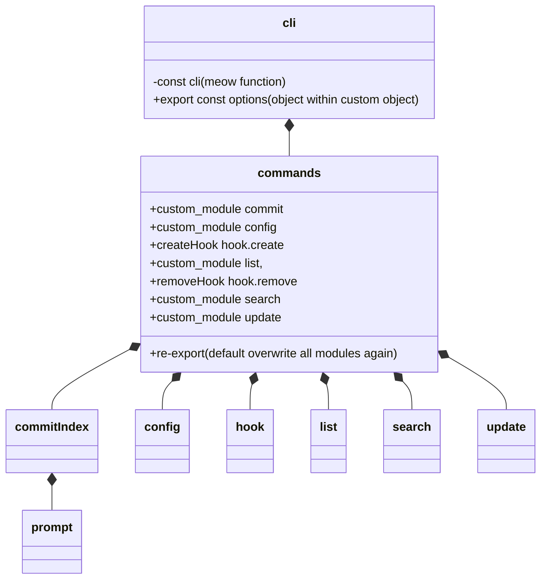

---
# configs for document itself.
title: "001 - Sneak peek gitmoji-cli"
lastModified: "2023-01-10"

# configs for annotating data to obsidian dataview plugin.
noteImportance: ⭐⭐⭐⭐
noteStatus: "in progress"
noteCertanity: "certain"
noteField:
  - "develop"
notePurpose:
  - "individual"
noteTimeliness:
  - "lts"

# configs for selecting seed type.
seedType:
  - "storage"
seedPurpose:
  - "My issues"
  - "Drawing and Understanding"

# configs to decide whether external contents are appropriate to me or not.
contentLevel:
  - "intermediate"
contentRepresentation:
  - "text"
contentPurpose:
  - "realworld"

# configs for querying particular datas to specify notes which have been noted expirences related to particular subject.
# e.g. short tips for useful vscode extensions to let me know how errors occur.
# tags=[#seed, #shortTip, #vscode, #extension, #errorHandling]
tags:
  - "seed"
---
# 그리면서 이해하기

- 클래스 다이어그램에 섹션 나누기 기능이 없다.
- 대충 이정도만 그려도 알겠으니 내 cli 설계할 때 전체 구조는 flowchart로 섹션 나눠서 그려놓고
- 구체적인 사항들은 class diagram으로 그리자.
- 코드 구조는 flowchart + class diagram으로. 전체 어플리케이션 설계는 flowchart + Entity Relation Diagram으로
- 그리고 나머지 복잡한 로직은 시퀀스 다이어그램(생략가능)을 그리거나 바로 구현해버리기.

# 대충 쓰면서 정리하기
- 루트 디렉토리의 packge.json의 bin 프로퍼티의 값을 아래와 같이 지정해 주었음.
```json {title="/package.json"}
{
	...
	"bin": {
		"gitmoji": "lib/cli.js"
	}
	...
}
```
- cli.js가 사실상 모듈의 메인이란 얘기. (yargs 모듈이 사용됨)
- utils를 제외한 코드들은 대부분 데이터의 형변환이나 의존성을 주입하는 코드들이다.
- 반면 utils에는 동적이고 프로그래밍적인 로직이 많이 포함된 코드들이 있다.(cache, filter, Hooks, getpath, isHookCreated, print 등)
- 즉 코드 구조만 잘 짜놓으면 기계적으로 구조에 맞춰 데이터타입 정의 정도만 해주고 나머지는 utils에 다 때려박고 그때그떄 가져다 쓰면 되는 구조다.