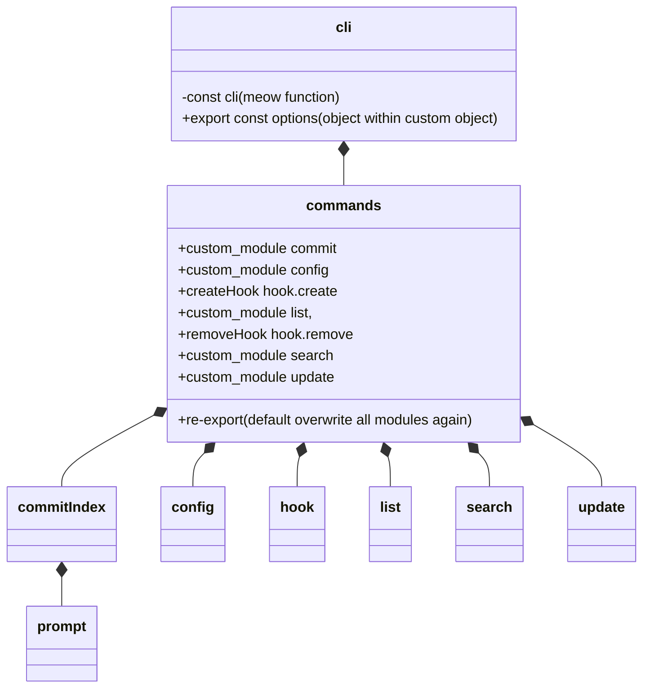

---
# configs for document itself.
title: "001 - Sneak peek gitmoji-cli"
lastModified: "2023-01-10"

# configs for annotating data to obsidian dataview plugin.
noteImportance: ⭐⭐⭐⭐
noteStatus: "in progress"
noteCertanity: "/certain"
noteField:
  - "develop"
notePurpose:
  - "individual"
noteTimeliness:
  - "lts"

# configs for selecting seed type.
seedType:
  - "storage"
seedPurpose:
  - "myIssue"
  - "Drawing for Understand"

# configs to decide whether external contents are appropriate to me or not.
contentLevel:
  - "intermediate"
contentRepresentation:
  - "text"
contentPurpose:
  - "realworld"

# configs for querying particular datas to specify notes which have been noted expirences related to particular subject.
# e.g. short tips for useful vscode extensions to let me know how errors occur.
# tags=[#seed, #shortTip, #vscode, #extension, #errorHandling]
tags:
  - "seed"
  - "coommadLineInterface"
---
# Drawings


# Undrstandings
- 루트 디렉토리의 packge.json의 bin 프로퍼티의 값을 아래와 같이 지정해 주었음.
```json {title="/package.json"}
{
	...
	"bin": {
		"gitmoji": "lib/cli.js"
	}
	...
}
```
- cli.js가 사실상 모듈의 메인이란 얘기.