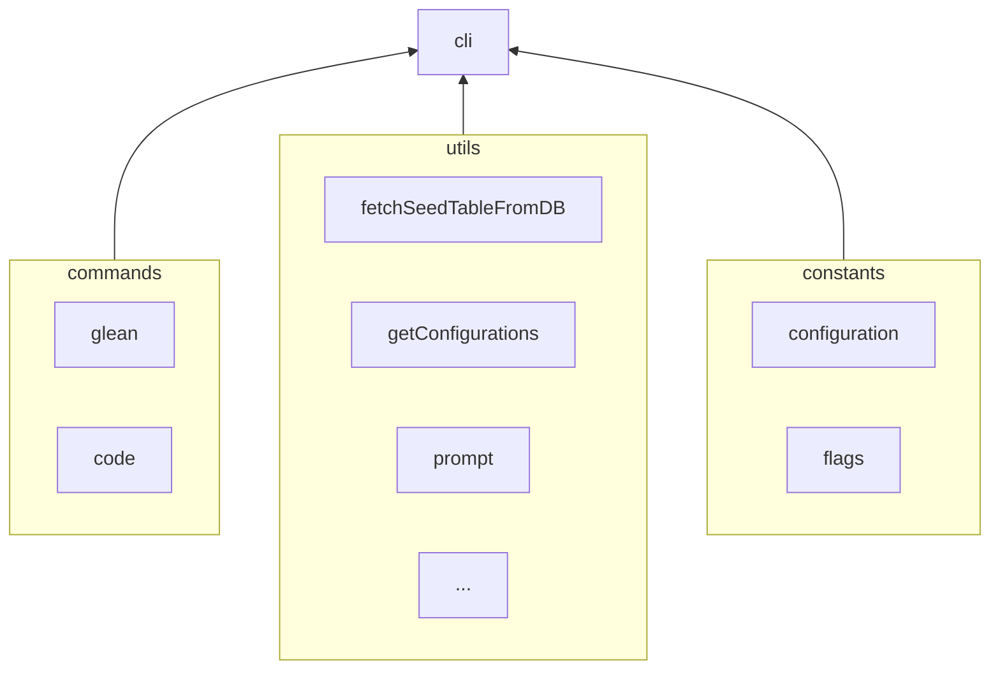

---
# configs for document itself.
title: "002 - Diagrams and explanations for mindulle cli project"
lastModified: "2023-01-12"

# configs for annotating data to obsidian dataview plugin.
noteImportance: ⭐⭐⭐⭐⭐
noteStatus: "in progress"
noteCertanity: "unlike"
noteField:
  - "develop"
notePurpose:
  - "individual"
noteTimeliness:
  - "lts"

# configs for selecting seed type.
seedType:
  - "storage"
seedPurpose:
  - "myIssue"
  - "Drawing for Understand"

# configs to decide whether external contents are appropriate to me or not.
contentLevel:
  - "intermediate"
contentRepresentation:
  - "text"
  - "img"
contentPurpose:
  - "realworld"
issueTriage:
  - 

# configs for querying particular datas to specify notes which have been noted expirences related to particular subject.
# e.g. short tips for useful vscode extensions to let me know how errors occur.
# tags=[#seed, #shortTip, #vscode, #extension, #errorHandling]
tags:
  - "seed"
---
# Drawings

# Understandings
- 
# 그리면서 이해하기

# 쓰면서 이해하기
- 구성 다하고 `packge.json`의 `bin`필드에 `node로 실행가능한 js 파일`을 주면 됨.
- 일단 prompt와 cli만 먼저 구현해보자.
- prompt가 사용 될 곳은 