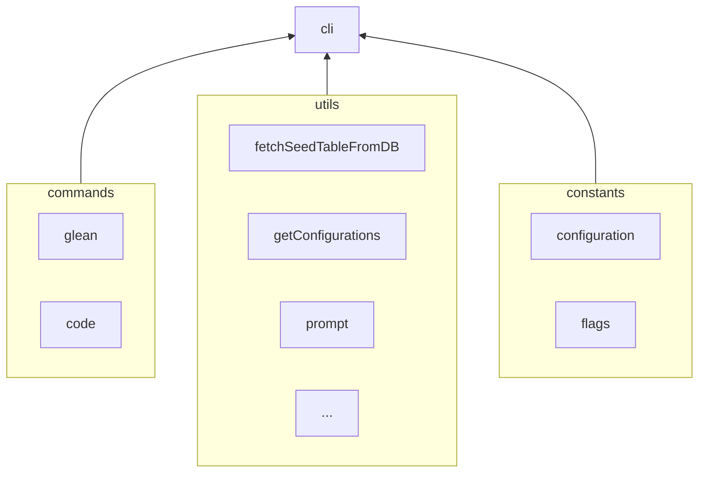

# 그리면서 이해하기

```mermaid
flowchart BT
	cli
	subgraph commands
		direction LR
		glean
		code
	end
	subgraph constants
		direction LR
		configuration
		flags
	end
	subgraph utils
		direction LR
		fetchSeedTableFromDB
		getConfigurations
		prompt
		...
	end
	commands --> cli
	utils --> cli
	constants --> cli
```

# 쓰면서 이해하기
- 구성 다하고 `packge.json`의 `bin`필드에 `node로 실행가능한 js 파일`을 주면 됨.
- 일단 prompt와 cli만 먼저 구현해보자.
- prompt가 사용 될 곳은 