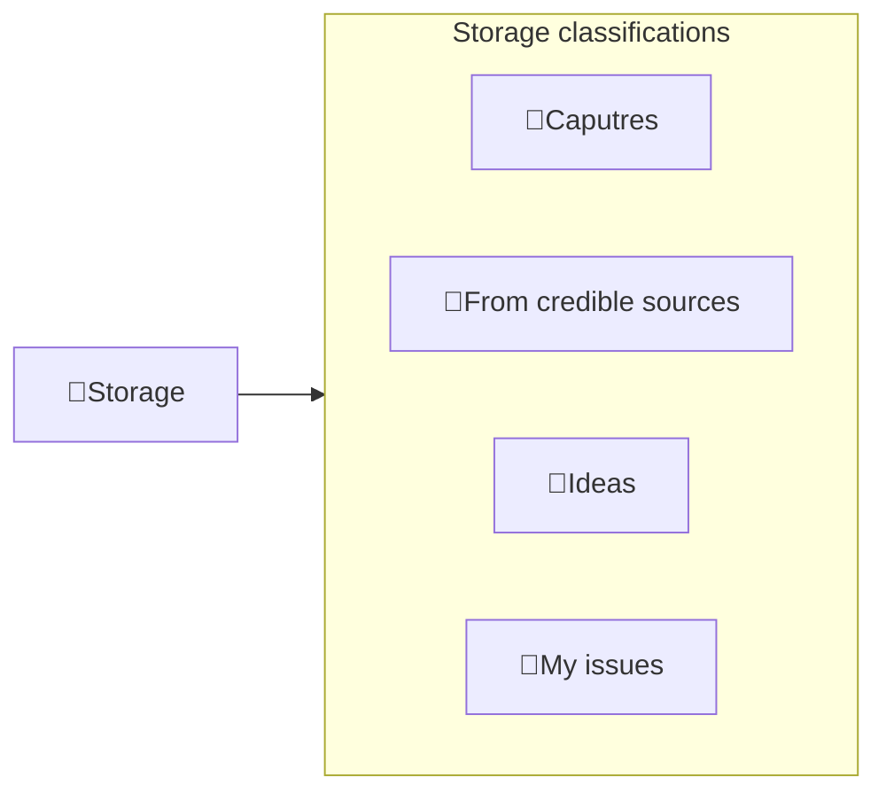

---
# configs for document itself.
title: "🎉Storage"
lastModified: "2023-01-08"

# field for querying only entry point notes.
isEntryPoint: true

# add some tags for specifying particular subjects.
tags:
  - "entrypoint"
---
# TL;DR
- Storage는 주요 학습 개념이지만 아직 경험해보지 못했고 호기심이 생기는 씨앗만 모아두는 역할을 합니다.

# Map of contents

- [[Develop/Seeds/Storage/Captures/🎉Captures|🎉Captures|]] : 밈이나 짧은 이미지 팁을 보관하는 방법(Eagle 활용) 서술
- [[Develop/Seeds/Storage/Ideas/🎉Ideas|🎉Ideas]] : 아이디어를 보관하는 방법 서술(엑스칼리드로우, 피그잼, Eagle 등 활용)
- [[Develop/Seeds/Storage/My issues/🎉My issues|🎉My issues]] : 내 이슈를 모아서 로깅된 링크들 정리 해두기(discord hook 활용중임도 확인)

# Features
- List up frequently used features.

# Issues
- what design patterns adapated to each features.
- how to pipe logics to build features.
- challenges during implementing features.
- helpful supports deserve to remember.
- Glean tips using `mindulle-cli` for digital gardening.

# Showcases
- construct visual gallery to summarize your expriences.
