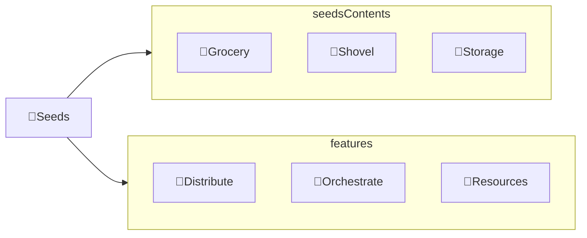

---
# configs for document itself.
title: "🎉Seeds"
lastModified: "2022-12-25"

# field for querying only entry point notes.
isEntryPoint: true

# add some tags for specifying particular subjects.
tags:
  - "entrypoint"
---
# TL;DR
- Seeds에 작성된 개념은 Tree 레벨에서 인용될 수 있습니다.

# Map of contents

- [[Develop/Seeds/Grocery/🎉Grocery|🎉Grocery]]
- [[Develop/Seeds/Shovel/🎉Shovel|🎉Shovel]]
- [[Develop/Seeds/Storage/🎉Storage|🎉Storage]]

# Features
- [[Develop/Seeds/🌱Distribute|🌱Distribute]] : 씨앗을 분류하기 위한 옵시디언 칸반
- [[Develop/Seeds/🎻Orchestrate|🎻Orchestrate]] : 모은 씨앗을 내가 자주 사용하는 업무용, 학습용 소프트웨어에서 어떻게 정리하고 관리할지를 전략화하여 정리해둔 문서.
- [[Develop/Seeds/🚚Resources|🚚Resources]]

# Issues
- what design patterns adapated to each features.
- how to pipe logics to build features.
- challenges during implementing features.
- helpful supports deserve to remember.
- Glean tips using `mindulle-cli` for digital gardening.

# Showcases
- construct visual gallery to summarize your expriences.

# Seeds의 구조

# 씨앗 관리
## 씨앗 모으고 분류하기
- [[Develop/Seeds/🎻Orchestrate]] : 씨앗 모으는 방법 정리
- [[Develop/Seeds/🌱Distribute]] : 

## 분류한 씨앗 내용 정리하기
### Grocery
- [[Develop/Seeds/Grocery/Database/🎉Database|🎉Database]] : `데이터베이스` 관련 씨앗[^씨앗]을 모으고 정리합니다.
- [[Develop/Seeds/Grocery/WebBackend/🎉WebBackend|🎉webBackend]] : `웹 백엔드` 관련 씨앗[^씨앗]을 모으고 정리합니다.
- [[Develop/Seeds/Grocery/WebFrontend/🎉WebFrontend|🎉webFrontend]] : `웹 프론트엔드` 관련 씨앗[^씨앗]을 모으고 정리합니다.

### TODO : Shovel
-  [[Develop/Seeds/Storage/Miscs/🎉Miscs]]
-  [[Develop/Seeds/Storage/My issues/🎉My issues]]
-  [[Develop/Seeds/Storage/Ideas/🎉Ideas]]

### TODO : Storage
### TODO : Miscs

## 씨앗 줍기
- [[Develop/Seeds/🚚Resources|Resources]]

[^씨앗]: 내가 직접 발견한 지식 중 아직 사용해보거나 검증되지 않고 쌓여있는 지식만을 부르는 개인 은어. [디지털 정원](https://maggieappleton.com/garden-history) 개념에서 빌려온 용어.