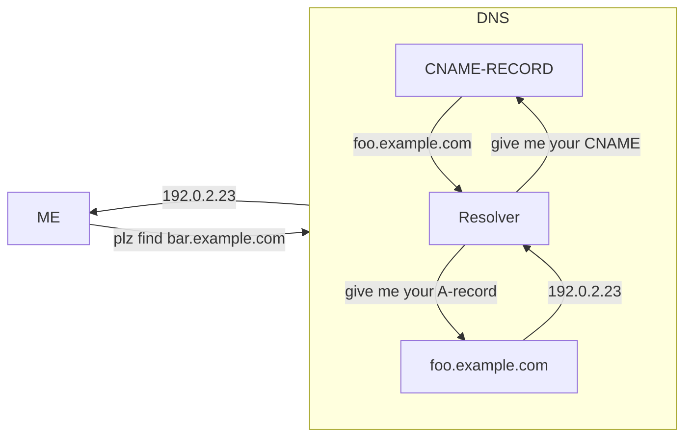

---
# configs for document itself.
title: "📚Dictionary"
lastModified: "2023-01-05"

# field for querying only dictionary notes.
isDictionary: true

# add some tags for specifying particular subjects.
tags:
  - "dictionary/network"
---
> [!todo] TODO
> Bring detailed descriptions into [[Develop/Trees/Dev/Basis/Computer Science/Network/🗝️Terminologies|🗝️Terminologies]]

# C
## CNAME
> **캐노니컬 네임 레코드**(Canonical Name record), 줄여서 **CNAME 레코드**(CNAME record)는 하나의 도메인 네임(에일리어스)을 다른 이름([표준 형식](https://ko.wikipedia.org/wiki/%ED%91%9C%EC%A4%80_%ED%98%95%EC%8B%9D "표준 형식")의 이름)으로 매핑시키는 [도메인 네임 시스템](https://ko.wikipedia.org/wiki/%EB%8F%84%EB%A9%94%EC%9D%B8_%EB%84%A4%EC%9E%84_%EC%8B%9C%EC%8A%A4%ED%85%9C "도메인 네임 시스템")(DNS)의 [리소스 레코드](https://ko.wikipedia.org/wiki/%EB%8F%84%EB%A9%94%EC%9D%B8_%EB%84%A4%EC%9E%84_%EC%8B%9C%EC%8A%A4%ED%85%9C "도메인 네임 시스템")의 일종이다. **_[Wikipedia](https://ko.wikipedia.org/wiki/CNAME_%EB%A0%88%EC%BD%94%EB%93%9C)_**
```shell {title="DNS"}
NAME                    TYPE   VALUE
--------------------------------------------------
bar.example.com.        CNAME  foo.example.com.
foo.example.com.        A      192.0.2.23
```
[A 레코드](https://ko.wikipedia.org/wiki/A_%EB%A0%88%EC%BD%94%EB%93%9C)가 _bar.example.com_ 를 찾을 때 리졸버는 CNAME 레코드를 보고 _foo.example.com_ 에서 확인을 재시작한 뒤 192.0.2.23을 반환한다.

- RFC [2219](https://datatracker.ietf.org/doc/html/rfc2219) – Use of DNS Aliases for Network Services

# H
?
## HTTP

## Hyper text
?
> **하이퍼텍스트**(Hypertext, [문화어](https://ko.wikipedia.org/wiki/%EB%AC%B8%ED%99%94%EC%96%B4 "문화어"): 초본문, 하이퍼본문)는 참조([하이퍼링크](https://ko.wikipedia.org/wiki/%ED%95%98%EC%9D%B4%ED%8D%BC%EB%A7%81%ED%81%AC "하이퍼링크"))를 통해 독자가 한 문서에서 다른 문서로 즉시 접근할 수 있는 텍스트이다. (...)  기존의 문서가 순차적이면서 서열형 구조라면, 하이퍼텍스트는 링크에 따라 그 차례가 바뀌는 임의적이면서 나열형인 구조를 가진다. 즉, 출판된 책처럼 작가의 의도대로 사용자가 따라가는 것이 아닌, 하이퍼링크로 연결된 문서들을 어떠한 행위(클릭)에 따라 자유롭게 이동할 수 있다. __*[위키백과](https://ko.wikipedia.org/wiki/%ED%95%98%EC%9D%B4%ED%8D%BC%ED%85%8D%EC%8A%A4%ED%8A%B8)*__
- 영문판 위키백과엔 [어원](https://en.wikipedia.org/wiki/Hypertext#Etymology)에 관한 자세한 설명이 있다. Hyper- 라는 말은 크기(size)가 큼을 의미하는 말이 아니라 구조(structure)가 복잡하고 거대함을 뜻하는 말이라고 한다.

## Hyper media
?
> (...) [얽혀 있는 정보 처리: 복잡한 것, 바뀌는 것, 확실치 않은 것을 위한 파일 구조](http://portal.acm.org/citation.cfm?id=806036) 논리 확장으로 [하이퍼텍스트](https://ko.wikipedia.org/wiki/%ED%95%98%EC%9D%B4%ED%8D%BC%ED%85%8D%EC%8A%A4%ED%8A%B8 "하이퍼텍스트")라는 용어가 쓰이는데, 그 안에서 그래픽, 오디오, 영상, 완전한 텍스트, 그리고 [하이퍼링크](https://ko.wikipedia.org/wiki/%ED%95%98%EC%9D%B4%ED%8D%BC%EB%A7%81%ED%81%AC "하이퍼링크")가 보통 비선형 매체의 정보를 만들기 위해 모여 있다. 이것은 더 넓은 용어의 _[멀티미디어](https://ko.wikipedia.org/wiki/%EB%A9%80%ED%8B%B0%EB%AF%B8%EB%94%94%EC%96%B4 "멀티미디어")_(하이퍼미디어와 더불어 상호 작용하지 않는 선형 관념을 말할 때 쓰일 수 있음)와는 대조된다.
> 
> [월드 와이드 웹](https://ko.wikipedia.org/wiki/%EC%9B%94%EB%93%9C_%EC%99%80%EC%9D%B4%EB%93%9C_%EC%9B%B9)(www)은 하이퍼미디어의 기본 예이다. 반면, 상호 작용을 하지 않는 [영화관](https://ko.wikipedia.org/wiki/%EC%98%81%ED%99%94%EA%B4%80 "영화관")의 관념은 하이퍼링크의 부재 때문에 비롯되는 표준 멀티미디어의 예이다. __*[위키백과](https://ko.wikipedia.org/wiki/%ED%95%98%EC%9D%B4%ED%8D%BC%EB%AF%B8%EB%94%94%EC%96%B4)*__
- 하이퍼링크를 포함한 다양한 웹 페이지의 에셋들을 합쳐서 __하이퍼 미디어__. 상호작용하지 *않는* 개념은 __멀티미디어__.


# I
## IP address
> An **Internet Protocol address** (**IP address**) is a numerical label such as _192.0.2.1_ that is connected to a [computer network](https://en.wikipedia.org/wiki/Computer_network "Computer network") that uses the [Internet Protocol](https://en.wikipedia.org/wiki/Internet_Protocol "Internet Protocol") for communication. **_[wikipedia](https://en.wikipedia.org/wiki/IP_address)_**
- [IP 주소 - 네이버 지식백과](https://terms.naver.com/entry.naver?docId=3571314&cid=59088&categoryId=59096)

# U
## URI 