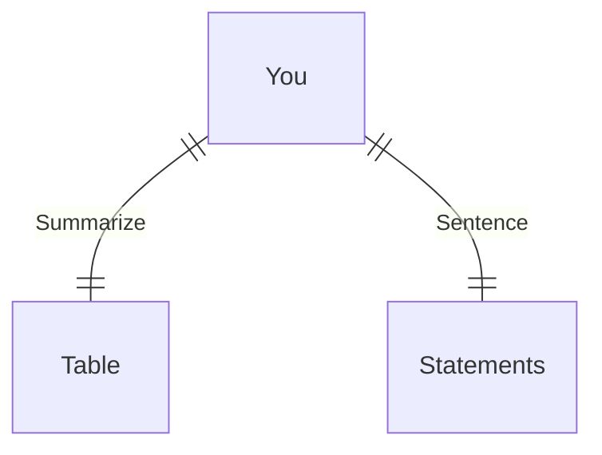

---
# configs for document itself.
title: "🎉3.11.1"
lastModified: "2022-12-30"

# field for querying only entry point notes.
isEntryPoint: true

# add some tags for specifying particular subjects.
tags:
  - "entrypoint"
---

# TL;DR
- you can summarize contents as a table format.
- or just write down statements you think it is important within 3 lines.

# Map of contents
- Draw a simple excalidraw scatch to understand how contents are constructed and networked.

# Features
- List up frequently used features.
- [[Develop/Trees/Dev/Basis/Languages/Python/Basic Syntax/contents/3.11.1/Class|Class]]
- [[Develop/Trees/Dev/Basis/Languages/Python/Basic Syntax/contents/3.11.1/Data Types|Data Types]]
- [[Develop/Trees/Dev/Basis/Languages/Python/Basic Syntax/contents/3.11.1/DISK IO|DISK IO]]
- [[Develop/Trees/Dev/Basis/Languages/Python/Basic Syntax/contents/3.11.1/Error & Exception|Error & Exception]]
- [[Develop/Trees/Dev/Basis/Languages/Python/Basic Syntax/contents/3.11.1/Module|Module]]
- [[Develop/Trees/Dev/Basis/Languages/Python/Basic Syntax/contents/3.11.1/Standard library - 1|Standard library - 1]]
- [[Develop/Trees/Dev/Basis/Languages/Python/Basic Syntax/contents/3.11.1/Standard library - 2|Standard library - 2]]
- 

# Issues
- what design patterns adapated to each features.
- how to pipe logics to build features.
- challenges during implementing features.
- helpful supports deserve to remember.
- Glean tips using `mindulle-cli` for digital gardening.

# Showcases
- construct visual gallery to summarize your expriences.
