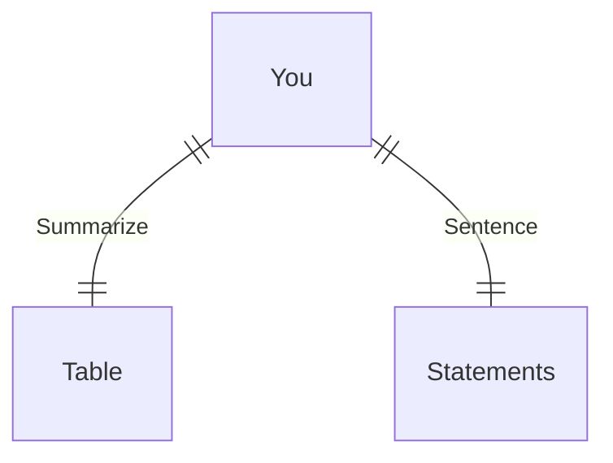

---
# configs for document itself.
title: "🎉Languages"
lastModified: "2022-12-27"

# field for querying only entry point notes.
isEntryPoint: true

# add some tags for specifying particular subjects.
tags:
  - "entrypoint"
---
# TL;DR
- you can summarize contents as a table format.
- or just write down statements you think it is important within 3 lines.

# Map of contents
- Draw a simple excalidraw scatch to understand how contents are constructed and networked.
- [[Develop/Trees/Dev/Basis/Languages/CSS/🎉CSS|🎉CSS]]
- [[Develop/Trees/Dev/Basis/Languages/HTML/🎉HTML|🎉HTML]]
- [[Develop/Trees/Dev/Basis/Languages/Javascript/🎉Javascript|🎉Javascript]]
- [[Develop/Trees/Dev/Basis/Languages/Markdown/🎉Markdown|🎉Markdown]]
- [[Develop/Trees/Dev/Basis/Languages/Shell script/🎉Shell script|🎉Shell script]]
- [[Develop/Trees/Dev/Basis/Languages/Typescript/🎉Typescript|🎉Typescript]]

# Features
- List up frequently used features.
- 

# Issues
- what design patterns adapated to each features.
- how to pipe logics to build features.
- challenges during implementing features.
- helpful supports deserve to remember.
- Glean tips using `mindulle-cli` for digital gardening.

# Showcases
- construct visual gallery to summarize your expriences.
