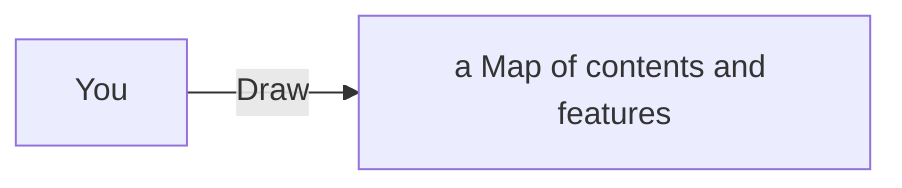

---
# configs for document itself.
title: "🎉Lint & Format"
lastModified: "2023-01-13"

# field for querying only entry point notes.
isEntryPoint: true

# add some tags for specifying particular subjects.
tags:
  - "entrypoint"
---
# TL;DR
- you can summarize contents as a table format.
- or just write down statements you think it is important within 3 lines.

# Map of contents

- 

# Features
- List up frequently used features.
- [[Develop/Trees/Dev/Programming/Languages/Javascript/Lint & Format/⚡Cheat sheet|⚡Cheat sheet]]
- [[Develop/Trees/Dev/Programming/Languages/Javascript/Lint & Format/🚚Resources|🚚Resources]]

# Issues
- what design patterns adapated to each features.
- how to pipe logics to build features.
- challenges during implementing features.
- helpful supports deserve to remember.
- Glean tips using `mindulle-cli` for digital gardening.

# Showcases
- construct visual gallery to summarize your expriences.
