---
# configs for document itself.
title: "State Diagram"
lastModified: "2023-01-10"
visibility: "public"

# configs for annotating data to obsidian dataview plugin.
noteImportance: ⭐⭐⭐⭐
noteStatus: "finished"
noteCertanity: "certain"
noteField:
  - "develop"
  - "devsigner"
notePurpose:
  - "background"
  - "individual"
  - "business"
noteTimeliness:
  - "lts"

# configs for selecting tree type.
treeType:
  - "learn"
treePurpose:
  - "webClipping"

# configs to decide whether external contents are appropriate to me or not.
contentLevel:
  - "beginner"
  - "intermediate"
  - "professional"
contentRepresentation:
  - "text"
  - "img"
contentPurpose:
  - "howto"
  - "reference"
  - "realworld"
contentOrigin:
  - "technicalDocument"

# configs for querying particular datas to specify notes which have been noted expirences related to particular subject.
# e.g. performance optimization using lighthouse in web development environments:
# tags=[#tree, #web, #lighthouse, #perfOpt]
tags:
  - "tree"
  - "mermaidjs"
---
```toc
style: bullet
max_depth: 3
```
## State diagrams 🌱

> "A state diagram is a type of diagram used in computer science and related fields to describe the behavior of systems. State diagrams require that the system described is composed of a __finite number of states__; sometimes, this is indeed the case, while at other times this is a reasonable abstraction." **_Wikipedia_**

Mermaid can render state diagrams. The syntax tries to be compliant with the syntax used in plantUml[^plantUML] as this will make it easier for users to share diagrams between mermaid and plantUml.

##### Code:
```
---
title: Simple sample
---
stateDiagram-v2
    [*] --> Still
    Still --> [*]

    Still --> Moving
    Moving --> Still
    Moving --> Crash
    Crash --> [*]
```
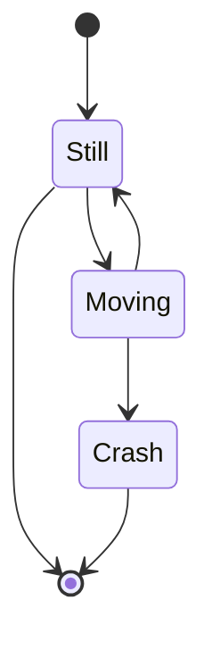

##### Code:
```
stateDiagram
    [*] --> Still
    Still --> [*]

    Still --> Moving
    Moving --> Still
    Moving --> Crash
    Crash --> [*]
```

In state diagrams systems are described in terms of *states* and how one *state* can change to another *state* via a *🎯transition.* The example diagram above shows three states: **Still**, **Moving** and **Crash**. You start in the **Still** state. From **Still** you can change to the **Moving** state. From **Moving** you can change either back to the **Still** state or to the **Crash** state. There is no transition from **Still** to **Crash**. (You can't crash if you're still.)

## States

A state can be declared in multiple ways. The simplest way is to define a state with just an id:

##### Code:
```
stateDiagram-v2
    stateId
```
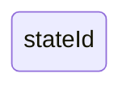

Another way is by using the state keyword with a description as per below:

##### Code:
```
stateDiagram-v2
    state "This is a state description" as s2
```
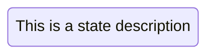

Another way to define a state with a description is to define the state id followed by a colon and the description:

##### Code:
```
stateDiagram-v2
    s2 : This is a state description
```


## Transitions 🌱

Transitions are __path/edges__ when one state passes into another. This is represented using text arrow, __"-->"__.

When you define a transition between two states and the states are not already defined, the undefined states are defined with the id from the transition. You can later add descriptions to states defined this way.

##### Code:
```
stateDiagram-v2
    s1 --> s2
```
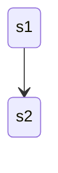
It is possible to add text to a transition to describe what it represents:

##### Code:
```
stateDiagram-v2
    s1 --> s2: A transition
```
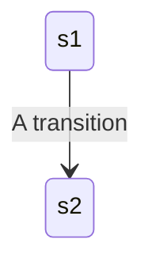

## Start and End 🌱

There are __two special states__ indicating __the start and stop__ of the diagram. These are written with the \[\*\] syntax and the direction of the transition to it defines it either as a start or a stop state.

##### Code:
```
stateDiagram-v2
    [*] --> s1
    s1 --> [*]
```
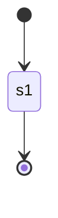

## Composite states 🎯⭐

In a __*real world*__ use of state diagrams you often end up with diagrams that are multidimensional as one state can have several internal states. These are called __*composite states*__ in this terminology.

In order to define a composite state you need to use the state keyword followed by an id and the body of the composite state between **`{}`**. See the example below:

##### Code:
```
stateDiagram-v2
    [*] --> First
    state First {
        [*] --> second
        second --> [*]
    }
```

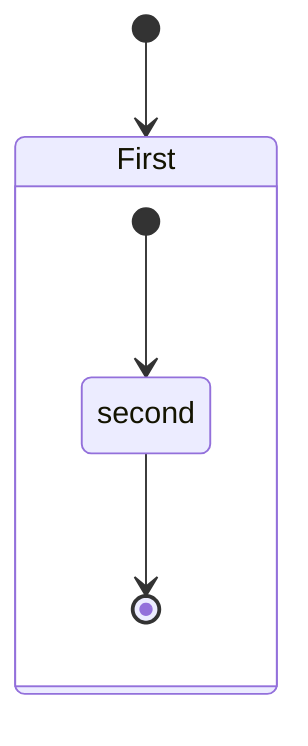

You can do this in several layers:
##### Code:
```
stateDiagram-v2
    [*] --> First

    state First {
        [*] --> Second

        state Second {
            [*] --> second
            second --> Third

            state Third {
                [*] --> third
                third --> [*]
            }
        }
    }
```

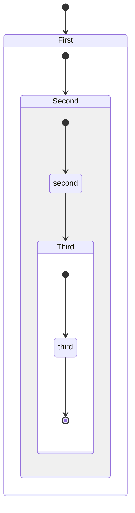

You can also define transitions also between composite states:

##### Code:
```
stateDiagram-v2
    [*] --> First
    First --> Second
    First --> Third

    state First {
        [*] --> fir
        fir --> [*]
    }
    state Second {
        [*] --> sec
        sec --> [*]
    }
    state Third {
        [*] --> thi
        thi --> [*]
    }
```

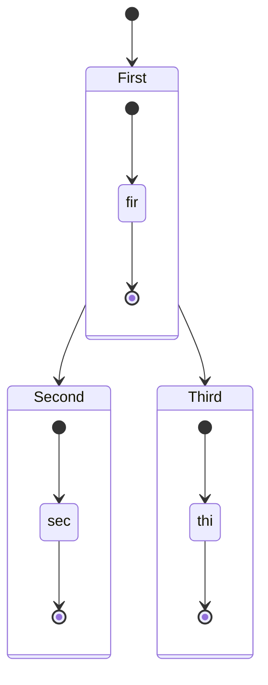

*You __can not__ define transitions __==between internal states== belonging to different composite states__*

## Choice 🎯⭐

Sometimes you need to model a choice between two or more paths, you can do so using `<<choice>>`.

##### Code:
```
stateDiagram-v2
    state if_state <<choice>>
    [*] --> IsPositive
    IsPositive --> if_state
    if_state --> False: if n < 0
    if_state --> True : if n >= 0
```
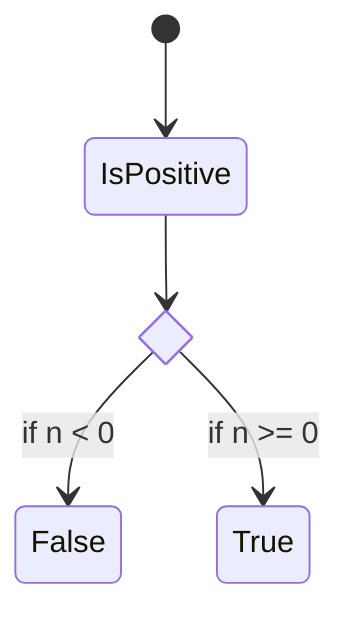

## Forks 🏁

It is possible to specify a fork in the diagram using `<<fork>>` `<<join>>`.

##### Code:
```
   stateDiagram-v2
    state fork_state <<fork>>
      [*] --> fork_state
      fork_state --> State2
      fork_state --> State3

      state join_state <<join>>
      State2 --> join_state
      State3 --> join_state
      join_state --> State4
      State4 --> [*]
```
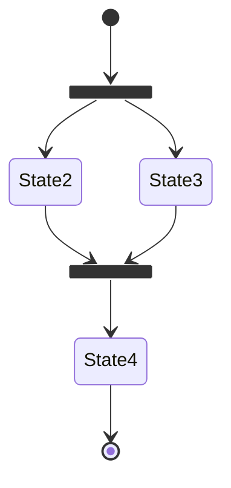

> [!NOTE] Fork/Join
> 현업에서 사용되는 __*github fork*__와 데이터베이스 __*join*__을 생각하면 쉬울 것 같다.

## Notes 🏁⭐

Sometimes nothing says it better than a Post-it note. That is also the case in state diagrams.

Here you can choose to put the note to the *right of* or to the *left of* a node.

##### Code:
```
    stateDiagram-v2
        State1: The state with a note
        note right of State1
            Important information! You can write
            notes.
        end note
        State1 --> State2
        note left of State2 : This is the note to the left.
```

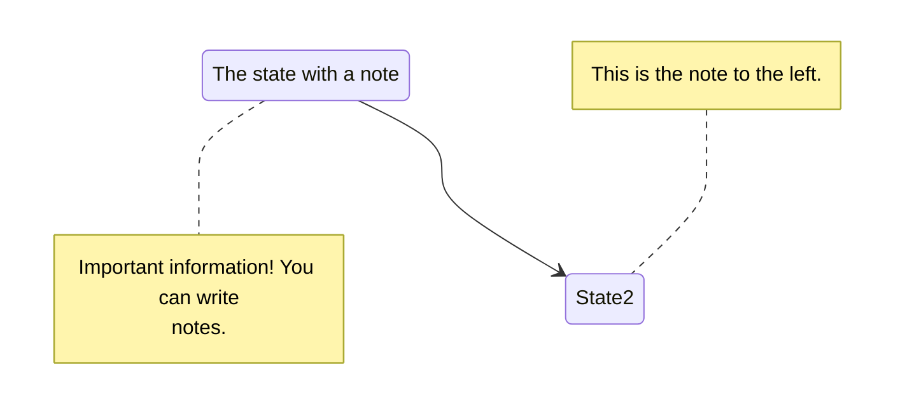

## Concurrency 🎯⭐

As in plantUml you can specify concurrency using the `--` symbol.

##### Code:
```
stateDiagram-v2
    [*] --> Active

    state Active {
        [*] --> NumLockOff
        NumLockOff --> NumLockOn : EvNumLockPressed
        NumLockOn --> NumLockOff : EvNumLockPressed
        --
        [*] --> CapsLockOff
        CapsLockOff --> CapsLockOn : EvCapsLockPressed
        CapsLockOn --> CapsLockOff : EvCapsLockPressed
        --
        [*] --> ScrollLockOff
        ScrollLockOff --> ScrollLockOn : EvScrollLockPressed
        ScrollLockOn --> ScrollLockOff : EvScrollLockPressed
    }
```

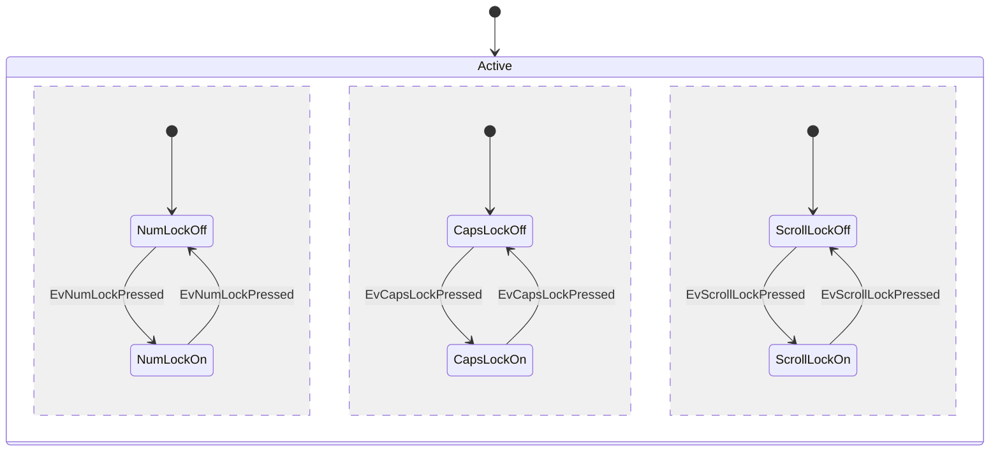

## Setting the direction of the diagram 🏁

With state diagrams you can use the direction statement to set the direction which the diagram will render like in this example.

##### Code:
```
stateDiagram
    direction LR
    [*] --> A
    A --> B
    B --> C
    state B {
      direction LR
      a --> b
    }
    B --> D
```

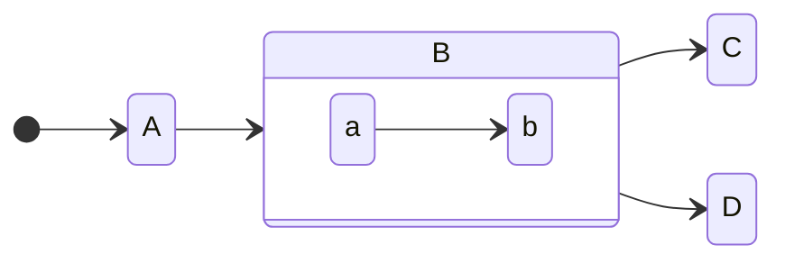

__Comments__ can be entered within a state diagram chart, which will be ignored by the parser. Comments need to be on their own line, and __must be prefaced with `%%` (double percent signs)__. Any text after the start of the comment to the next newline will be treated as a comment, including any diagram syntax

##### Code:
```
stateDiagram-v2
    [*] --> Still
    Still --> [*]
%% this is a comment
    Still --> Moving
    Moving --> Still %% another comment
    Moving --> Crash
    Crash --> [*]
```


## Styling with classDefs 🏁⭐

As with other diagrams (like flowcharts), you can define a style in the diagram itself and apply that named style to a state or states in the diagram.

**These are the current limitations with state diagram classDefs:**

1.  Cannot be applied to start or end states
2.  Cannot be applied to or within composite states

*These are in development and will be available in a future version.*

You define a style using the `classDef` keyword, which is short for "class definition" (where "class" means something like a *CSS class*) followed by *a name for the style,* and then one or more *property-value pairs*. Each *property-value pair* is a *[valid CSS property name](https://www.w3.org/TR/CSS/#properties)* followed by a colon (`:`) and then a *value.*

Here is an example of a classDef with just one property-value pair:

```css
    classDef movement font-style:italic;
```

where
-   the *name* of the style is `movement`
-   the only *property* is `font-style` and its *value* is `italic`

If you want to have __more than one *property-value pair*__ then you __==put a comma (`,`)==__ between each *property-value pair.*

Here is an example with three property-value pairs:

```css
    classDef badBadEvent fill:#f00,color:white,font-weight:bold,stroke-width:2px,stroke:yellow
```

where
-   the *name* of the style is `badBadEvent`
-   the first *property* is `fill` and its *value* is `#f00`
-   the second *property* is `color` and its *value* is `white`
-   the third *property* is `font-weight` and its *value* is `bold`
-   the fourth *property* is `stroke-width` and its *value* is `2px`
-   the fifth *property* is `stroke` and its *value* is `yello`

### Apply classDef styles to states 🏁⭐

There are two ways to apply a `classDef` style to a state:

1. ⭐use the `class` keyword to apply a classDef style to one or more states in a single statement, or 
2.  use the `:::` operator to apply a classDef style to a state as it is being used in a transition statement (e.g. with an arrow to/from another state)

#### 1\. `class` statement

A `class` statement tells Mermaid to apply the named classDef to one or more classes. The form is:

text
```text
    class [one or more state names, separated by commas] [name of a style defined with classDef]
```

Here is an example applying the `badBadEvent` style to a state named `Crash`:

text

```text
class Crash badBadEvent
```

Here is an example applying the `movement` style to the two states `Moving` and `Crash`:

text

```text
class Moving, Crash movement
```

Here is a diagram that shows the examples in use. Note that the `Crash` state has two classDef styles applied: `movement` and `badBadEvent`

##### Code:
```
   stateDiagram
   direction TB

   accTitle: This is the accessible title
   accDescr: This is an accessible description

   classDef notMoving fill:white
   classDef movement font-style:italic
   classDef badBadEvent fill:#f00,color:white,font-weight:bold,stroke-width:2px,stroke:yellow

   [*]--> Still
   Still --> [*]
   Still --> Moving
   Moving --> Still
   Moving --> Crash
   Crash --> [*]

   class Still notMoving
   class Moving, Crash movement
   class Crash badBadEvent
   class end badBadEvent
```

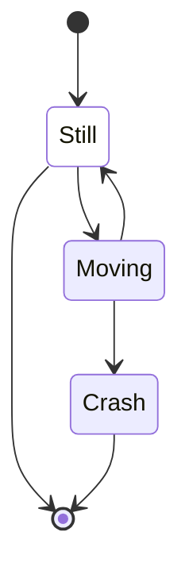


> [!error] Maybe this feature..
> Does not work in plain obsidian application. I commented some lines of code.
> see this

#### 2\. `:::` operator to apply a style to a state

You can apply a classDef style to a state using the `:::` (three colons) operator. The syntax is

```
[state]:::[style name]
```

You can use this in a diagram within a statement using a class. This includes the start and end states. For example:

##### Code:
```
stateDiagram
   direction TB

   accTitle: This is the accessible title
   accDescr: This is an accessible description

   classDef notMoving fill:white
   classDef movement font-style:italic;
   classDef badBadEvent fill:#f00,color:white,font-weight:bold,stroke-width:2px,stroke:yellow

   [*] --> Still:::notMoving
   Still --> [*]
   Still --> Moving:::movement
   Moving --> Still
   Moving --> Crash:::movement
   Crash:::badBadEvent --> [*]
```

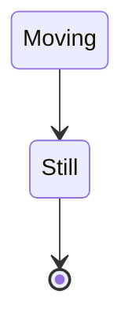

> [!error] Maybe this feature too..
> Does not work in plain obsidian application. I commented some lines of code.

## Spaces in state names

Spaces can be added to a state by first defining the state with an id and then referencing the id later.

In the following example there is a state with the id **yswsii** and description **Your state with spaces in it**. After it has been defined, **yswsii** is used in the diagram in the first transition (`[*] --> yswsii`) and also in the transition to **YetAnotherState** (`yswsii --> YetAnotherState`).  
(**yswsii** has been styled so that it is different from the other states.)

##### Code:
```
stateDiagram
    classDef yourState font-style:italic,font-weight:bold,fill:white

    yswsii: Your state with spaces in it
    [*] --> yswsii:::yourState
    [*] --> SomeOtherState
    SomeOtherState --> YetAnotherState
    yswsii --> YetAnotherState
    YetAnotherState --> [*]
```

[^plantUML]: 다이어그램을 코딩 할 수 있는 [서비스](http://www.plantuml.com/).[ 노션에 임베드](https://www.notion.so/Notion-Diagrams-6d8bd0a3a0e442e2bd092fa77e8199aa)도 가능한 듯