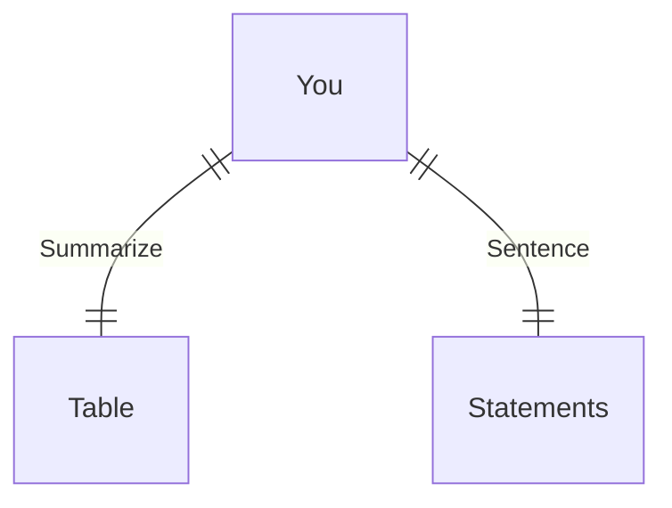

---
# configs for document itself.
title: "🎉contents"
lastModified: "2022-12-26"

# field for querying only entry point notes.
isEntryPoint: true

# add some tags for specifying particular subjects.
tags:
  - "entrypoint"
---
```toc
style: bullet
```

# TL;DR
- you can summarize contents as a table format.
- or just write down statements you think it is important within 3 lines.



# Map of contents
- Draw a simple excalidraw scatch to understand how contents are constructed and networked.
- [[Develop/Trees/Dev/Programming/Libs&Fwks/By subject/Diagraming/mermaid.js/contents/Diagram Syntax/🎉Diagram Syntax|🎉Diagram Syntax]]

# Features
- List up frequently used features.

# Issues
- what design patterns adapated to each features.
- how to pipe logics to build features.
- challenges during implementing features.
- helpful supports deserve to remember.
- Glean tips using `mindulle-cli` for digital gardening.

# Showcases
- construct visual gallery to summarize your expriences.

# Note taking

> [!tip] Mark cute emojis for your note-taking!

| Emoji | Meaning                                                                                          |
|:-----:| ------------------------------------------------------------------------------------------------ |
|  🌱   | Basic concepts.                                                                                   |
|  ⭐   | My favorites.                                                                                     |
|  🎯   | To implement issue that have specific purpose.                                                            |
|  🏁   | Not essential feature. can be used optionally.                                                                                                 |
|  🐞   | Have possibilities that feature make some annoying situation 😕                                     |
|  🔥   | Have possibilities that feature make some critical issue and will kill our service in the end!! 😱 |

# Version control for this document
## Up-to-date
> [!done] Current released version : v9.3.0
> last checked: 2022-12-26

## Deprecated
### vmajor.minor.patch