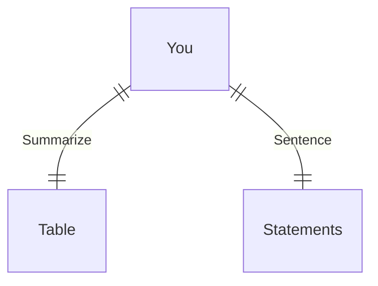

---
# configs for document itself.
title: "🎉Syntax"
lastModified: "2022-12-27"

# field for querying only entry point notes.
isEntryPoint: true

# add some tags for specifying particular subjects.
tags:
  - "entrypoint"
---
# TL;DR
- you can summarize contents as a table format.
- or just write down statements you think it is important within 3 lines.

# Map of contents
- Draw a simple excalidraw scatch to understand how contents are constructed and networked.

# Features
- List up frequently used features.
- [[Develop/Trees/Dev/ingredients/Languages/CSS/Code/Markup/Syntax/Inheritance|Inheritance]]
- [[Develop/Trees/Dev/ingredients/Languages/CSS/Code/Markup/Syntax/Learn css|Learn css]]
- [[Develop/Trees/Dev/ingredients/Languages/CSS/Code/Markup/Syntax/Pesudo-classes|Pesudo-classes]]
- [[Develop/Trees/Dev/ingredients/Languages/CSS/Code/Markup/Syntax/Pesudo-elemnts|Pesudo-elemnts]]
- [[Develop/Trees/Dev/ingredients/Languages/CSS/Code/Markup/Syntax/Selectors|Selectors]]
- [[Develop/Trees/Dev/ingredients/Languages/CSS/Code/Markup/Syntax/Specificity|Specificity]]
- [[Develop/Trees/Dev/ingredients/Languages/CSS/Code/Markup/Syntax/The cascade|The cascade]]

# Issues
- what design patterns adapated to each features.
- how to pipe logics to build features.
- challenges during implementing features.
- helpful supports deserve to remember.
- Glean tips using `mindulle-cli` for digital gardening.

# Showcases
- construct visual gallery to summarize your expriences.
