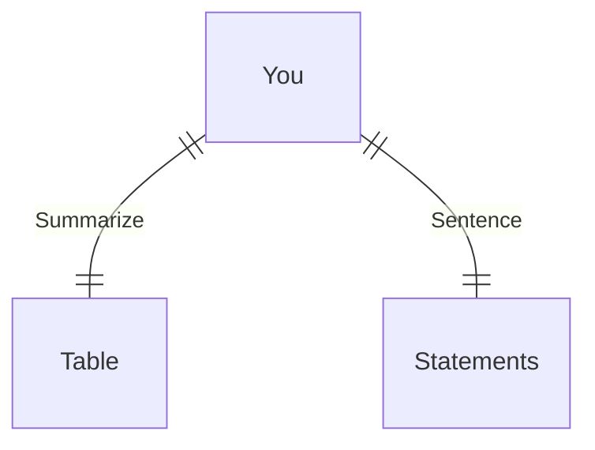

---
# configs for document itself.
title: "🎉HTML"
lastModified: "2022-12-21"

# field for querying only entry point notes.
isEntryPoint: true

# add some tags for specifying particular subjects.
tags:
  - "entrypoint"
---
# TL;DR
- you can summarize contents as a table format.
- or just write down statements you think it is important within 3 lines.

# Map of contents

%%[🖋 Edit in Excalidraw](Develop/Trees/Dev/ingredients/Languages/HTML/📦assets/🎉HTML%202022-12-21%2002.32.28.excalidraw.md), and the [light exported image](Develop/Trees/Dev/ingredients/Languages/HTML/📦assets/🎉HTML%202022-12-21%2002.32.28.excalidraw.light.svg)%%

# Features
- Markup
- Form
- Semantic tags
- enmet and snippets
- Naming conventions
- Document Object Model

# Issues
- what design patterns adapated to each features.
- how to pipe logics to build features.
- challenges during implementing features.
- helpful supports deserve to remember.
- Glean tips using `mindulle-cli` for digital gardening.

# Showcases
- construct visual gallery to summarize your expriences.

# Markup tips
- Enmet and snippets
- Naming and conventions

