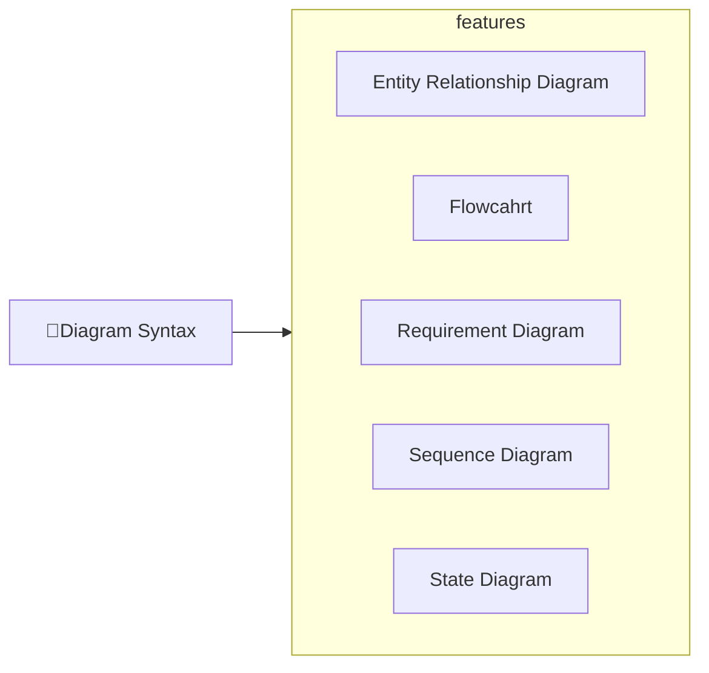

---
# configs for document itself.
title: "🎉Diagram Syntax"
lastModified: "2022-12-20"

# field for querying only entry point notes.
isEntryPoint: true

# add some tags for specifying particular subjects.
tags:
  - "entrypoint"
  - "mermaidjs"
---
# TL;DR
- you can summarize contents as a table format.
- or just write down statements you think it is important within 3 lines.

# Map of contents

- [[Develop/Trees/Dev/ingredients/Libs&Fwks/By subject/Diagraming/mermaid.js/contents/Diagram Syntax/Entity Relationship Diagram|Entity Relationship Diagram]]
- [[Develop/Trees/Dev/ingredients/Libs&Fwks/By subject/Diagraming/mermaid.js/contents/Diagram Syntax/Flowchart|Flowcahrt]]
- [[Develop/Trees/Dev/ingredients/Libs&Fwks/By subject/Diagraming/mermaid.js/contents/Diagram Syntax/Requirement Diagram|Requirement Diagram]]
- [[Develop/Trees/Dev/ingredients/Libs&Fwks/By subject/Diagraming/mermaid.js/contents/Diagram Syntax/Sequence Diagram|Sequence Diagram]]
- [[Develop/Trees/Dev/ingredients/Libs&Fwks/By subject/Diagraming/mermaid.js/contents/Diagram Syntax/State Diagram|State Diagram]]

# Showcases
- construct visual gallery to summarize your expriences.
