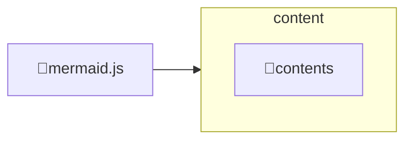

---
# configs for document itself.
title: "🎉mermaid.js"
lastModified: "2022-12-20"

# field for querying only entry point notes.
isEntryPoint: true

# add some tags for specifying particular subjects.
tags:
  - "entrypoint"
  - "mermaidjs"
---
# Map of contents

- [[Develop/Trees/Dev/ingredients/Libs&Fwks/By subject/Diagraming/mermaid.js/contents/🎉contents|🎉contents]]
