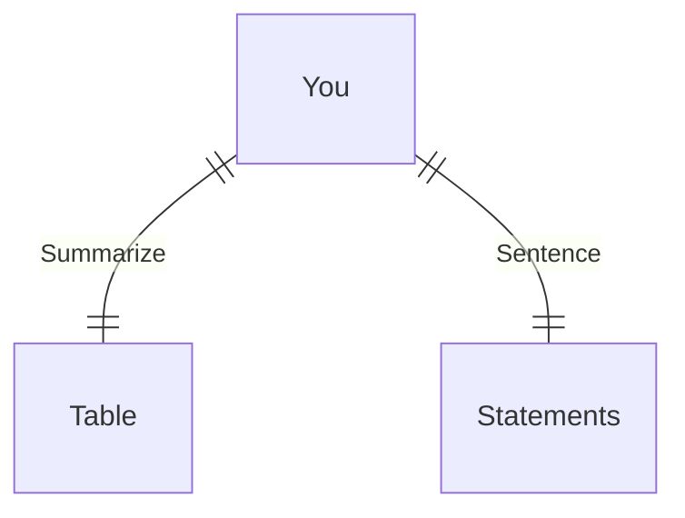
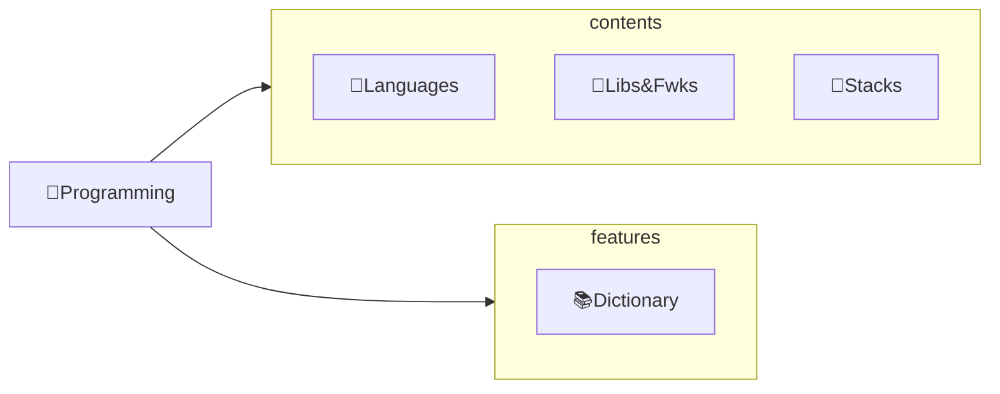

---
# configs for document itself.
title: "🎉Basis"
lastModified: "2022-12-22"

# field for querying only entry point notes.
isEntryPoint: true

# add some tags for specifying particular subjects.
tags:
  - "entrypoint"
---
# TL;DR
- you can summarize contents as a table format.
- or just write down statements you think it is important within 3 lines.

# Map of contents

- [[Develop/Trees/Dev/ingredients/Languages/🎉Languages|🎉Languages]]
- [[Develop/Trees/Dev/ingredients/Libs&Fwks/🎉Libs&Fwks|🎉Libs&Fwks]]
- [[Develop/Trees/Dev/ingredients/Stacks/🎉Stacks|🎉Stacks]]

# Features
- List up frequently used features.
- [[Develop/Trees/Dev/ingredients/📚Dictionary|📚Dictionary]]
- [[Develop/Trees/Dev/ingredients/👓Look at a glance|👓Look at a glance]]

# Issues
- what design patterns adapated to each features.
- how to pipe logics to build features.
- challenges during implementing features.
- helpful supports deserve to remember.
- Glean tips using `mindulle-cli` for digital gardening.

# Showcases
- construct visual gallery to summarize your expriences.
