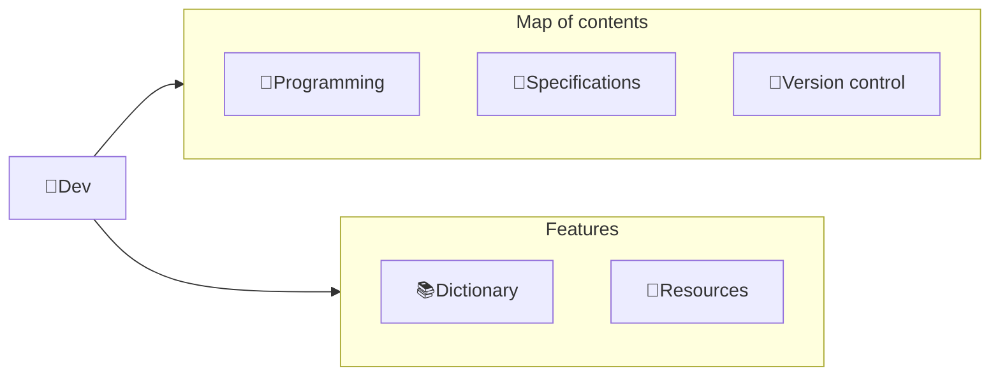

---
# configs for document itself.
title: "🎉Dev"
lastModified: "2022-12-14"

# field for querying only entry point notes.
isEntryPoint: true

# add some tags for specifying particular subjects.
tags:
  - "entrypoint"
---
```toc
style: bullet
```

# TL;DR
- you can summarize contents as a table format.
- or just write down statements you think it is important within 3 lines.


# Map of contents

- [[Develop/Trees/Dev/Programming/🎉Programming|🎉Programming]]
- [[Develop/Trees/Dev/Specifications/🎉Specifications|🎉Specifications]]
- [[Develop/Trees/Dev/Version control/🎉Version control|🎉Version control]]

# Features
- [[Develop/Trees/Dev/📚Dictionary|📚Dictionary]]
- [[Develop/Trees/Dev/🚚Resources|🚚Resources]]

# Issues
- what design patterns adapated to each features.
- how to pipe logics to build features.
- challenges during implementing features.
- helpful supports deserve to remember.
- Glean tips using `mindulle-cli` for digital gardening.

# Showcases
- construct visual gallery to summarize your expriences.

# See also
- Further readings
