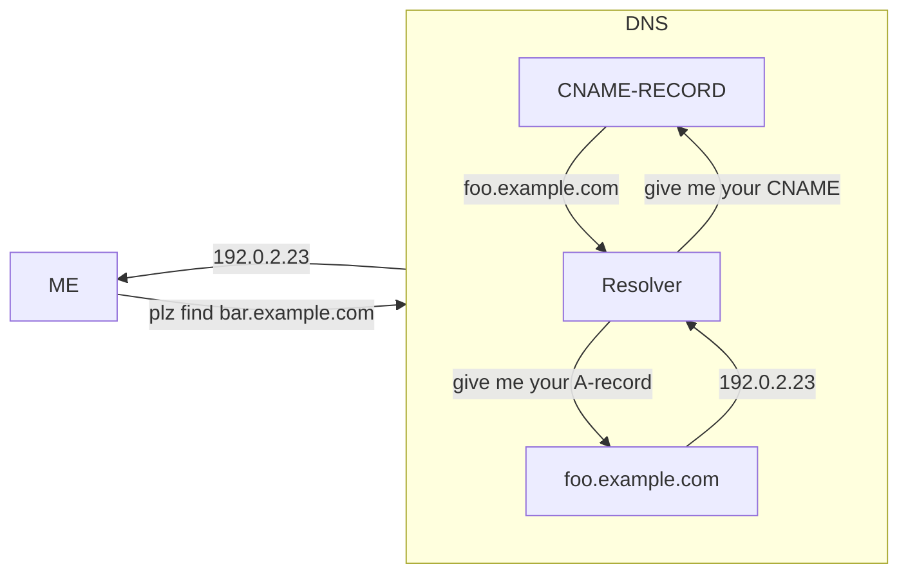

---
# configs for document itself.
title: "📚Dictionary"
lastModified: "2023-01-05"

# field for querying only dictionary notes.
isDictionary: true

# add some tags for specifying particular subjects.
tags:
  - "dictionary"
---
> [!error] TODO
> Bring detailed descriptions into [[Develop/Trees/Learn/6th standards/Network/🗝️Terminologies|🗝️Terminologies]]

# C
## CNAME
> **캐노니컬 네임 레코드**(Canonical Name record), 줄여서 **CNAME 레코드**(CNAME record)는 하나의 도메인 네임(에일리어스)을 다른 이름([표준 형식](https://ko.wikipedia.org/wiki/%ED%91%9C%EC%A4%80_%ED%98%95%EC%8B%9D "표준 형식")의 이름)으로 매핑시키는 [도메인 네임 시스템](https://ko.wikipedia.org/wiki/%EB%8F%84%EB%A9%94%EC%9D%B8_%EB%84%A4%EC%9E%84_%EC%8B%9C%EC%8A%A4%ED%85%9C "도메인 네임 시스템")(DNS)의 [리소스 레코드](https://ko.wikipedia.org/wiki/%EB%8F%84%EB%A9%94%EC%9D%B8_%EB%84%A4%EC%9E%84_%EC%8B%9C%EC%8A%A4%ED%85%9C "도메인 네임 시스템")의 일종이다. **_[Wikipedia](https://ko.wikipedia.org/wiki/CNAME_%EB%A0%88%EC%BD%94%EB%93%9C)_**
```shell {title="DNS"}
NAME                    TYPE   VALUE
--------------------------------------------------
bar.example.com.        CNAME  foo.example.com.
foo.example.com.        A      192.0.2.23
```
[A 레코드](https://ko.wikipedia.org/wiki/A_%EB%A0%88%EC%BD%94%EB%93%9C)가 _bar.example.com_ 를 찾을 때 리졸버는 CNAME 레코드를 보고 _foo.example.com_ 에서 확인을 재시작한 뒤 192.0.2.23을 반환한다.

- RFC [2219](https://datatracker.ietf.org/doc/html/rfc2219) – Use of DNS Aliases for Network Services

# H
## HTTP

# U
## URI 