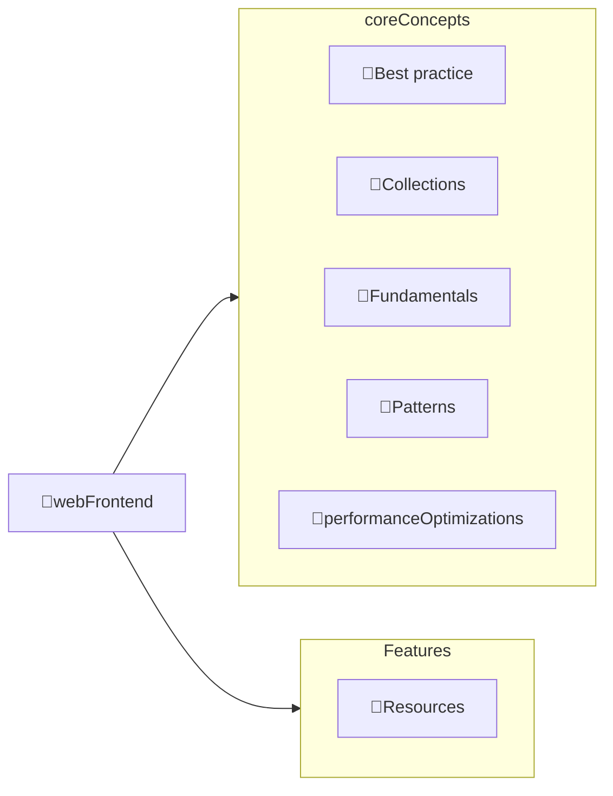

---
# configs for document itself.
title: "🎉webFrontend"
lastModified: "2022-12-27"

# field for querying only entry point notes.
isEntryPoint: true

# add some tags for specifying particular subjects.
tags:
  - "entrypoint"
---
# TL;DR
- you can summarize contents as a table format.
- or just write down statements you think it is important within 3 lines.

# Map of contents

- [[Develop/Trees/Learn/Realworld/webFrontend/Fundamentals/🎉Fundamentals|🎉Fundamentals]] : Basic and fundamental concepts to develop web application.
- [[Develop/Trees/Learn/Realworld/webFrontend/Collections/🎉Collections|🎉Collections]] : Advanced concepts needed when you accustomed to  develop web frontend. Such as animation rendering, easing function for webGL or webGPU, etc...
- [[Develop/Trees/Learn/Realworld/webFrontend/Best practice/🎉Best practice|🎉Best practice]] : Best practices for implementation of web component,  construct clean architecture, or collecting utils functions for scriptings.
- [[Develop/Trees/Learn/Realworld/webFrontend/Performance Optimization/🎉Performance Optimization|🎉Performance Optimization]] : Theorical basis for Performance optimization such as how to use lighthouse, how developer notice there are leakness of memory, etc...
- [[Develop/Trees/Learn/Realworld/webFrontend/Patterns/🎉Patterns|🎉Patterns]] : Prefered patterns which is used in realworld development. Such as atomic component design, state management methodlogies, communication with other sources, and so on ...

# Features
- [[Develop/Trees/Learn/Realworld/webFrontend/🚚Resources|🚚Resources]]

# Issues
- what design patterns adapated to each features.
- how to pipe logics to build features.
- challenges during implementing features.
- helpful supports deserve to remember.
- Glean tips using `mindulle-cli` for digital gardening.

# Showcases
- construct visual gallery to summarize your expriences.
