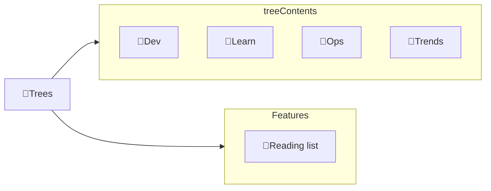

---
# configs for document itself.
title: "🎉Trees"
lastModified: "2022-12-25"

# field for querying only entry point notes.
isEntryPoint: true

# add some tags for specifying particular subjects.
tags:
  - "entrypoint"
---
# TL;DR
- you can summarize contents as a table format.
- or just write down statements you think it is important within 3 lines.

# Map of contents

- [[Develop/Trees/Dev/🎉Dev|🎉Dev]] : __코드 작성__ 단계에서 정리된 나무[^나무] 모음
- [[Develop/Trees/Learn/🎉Learn|🎉Learn]] : **개념 학습** 단계에서 정리된  나무[^나무] 모음
- [[Develop/Trees/Ops/🎉Ops|🎉Ops]] : **운영 및 배포** 단계에서 정리된 나무[^나무] 모음
- [[Develop/Trees/Trends/🎉Trends|🎉Trends]] : **동향 파악** 단계에서 정리된 나무[^나무] 모음

# Features
- [[Develop/Trees/🔖Reading list as developer|🔖Reading list as developer]]

# Issues
- what design patterns adapated to each features.
- how to pipe logics to build features.
- challenges during implementing features.
- helpful supports deserve to remember.
- Glean tips using `mindulle-cli` for digital gardening.

# Showcases
- construct visual gallery to summarize your expriences.

[^나무]: Grocery의 씨앗이나 검증된 공식문서에서 온 지식이나 학문적으로 보편성을 갖는 개념을 부르는 개인 은어 . [디지털 정원](https://maggieappleton.com/garden-history) 개념에서 빌려온 용어.