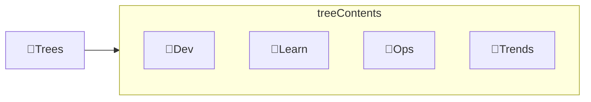

---
# configs for document itself.
title: "🎉Trees"
lastModified: "2022-12-25"

# field for querying only entry point notes.
isEntryPoint: true

# add some tags for specifying particular subjects.
tags:
  - "entrypoint"
---
# TL;DR
- you can summarize contents as a table format.
- or just write down statements you think it is important within 3 lines.

# Map of contents

- [[Develop/Trees/Dev/🎉Dev|🎉Dev]] : __개발__ 단계에서 습관화 해 둘 것들
- [[Develop/Trees/Ops/🎉Ops|🎉Ops]] : **운영 및 배포** 단계에서 구축해야할 환경
- [[Develop/Trees/Events/🎉Events|🎉Events]] : **동향 파악**
