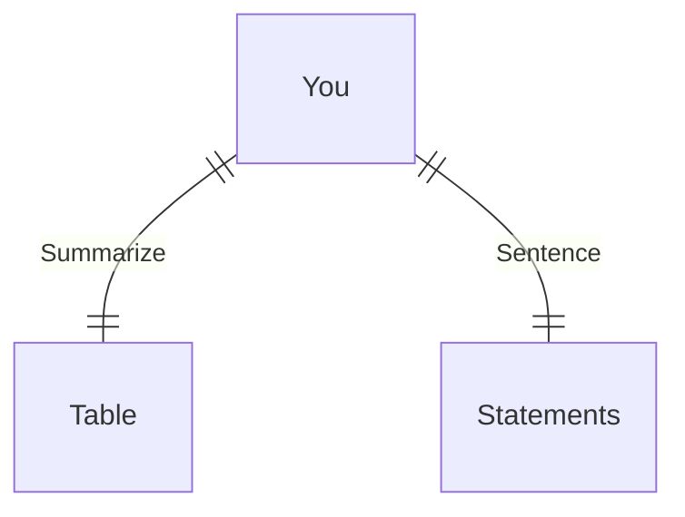

---
# configs for document itself.
title: "🎉Trees"
lastModified: "2022-12-25"

# field for querying only entry point notes.
isEntryPoint: true

# add some tags for specifying particular subjects.
tags:
  - "entrypoint"
---
```toc
style: bullet
```

# TL;DR
- you can summarize contents as a table format.
- or just write down statements you think it is important within 3 lines.



# Map of contents
- Draw a simple excalidraw scatch to understand how contents are constructed and networked.
- [[Develop/Trees/Dev/🎉Dev|🎉Dev]] : 현업 개발중 __코드 작성__ 단계에서 사용할 나무[^나무] 모음
- [[Develop/Trees/Infra/🎉Infra|🎉Infra]] : 현업 개발 중 __인프라 구축__ 단계에서 사용할 나무[^나무] 모음
- [[Develop/Trees/Learn/🎉Learn|🎉Learn]]
- [[Develop/Trees/Trends/🎉Trends|🎉Trends]]

# Features
- List up frequently used features.
- [[Develop/Trees/🔖Reading list|🔖Reading list]]

# Issues
- what design patterns adapated to each features.
- how to pipe logics to build features.
- challenges during implementing features.
- helpful supports deserve to remember.
- Glean tips using `mindulle-cli` for digital gardening.

# Showcases
- construct visual gallery to summarize your expriences.

[^나무]: Grocery의 씨앗이나 검증된 공식문서에서 온 지식이나 학문적으로 보편성을 갖는 개념을 부르는 개인 은어 . [디지털 정원](https://maggieappleton.com/garden-history) 개념에서 빌려온 용어.