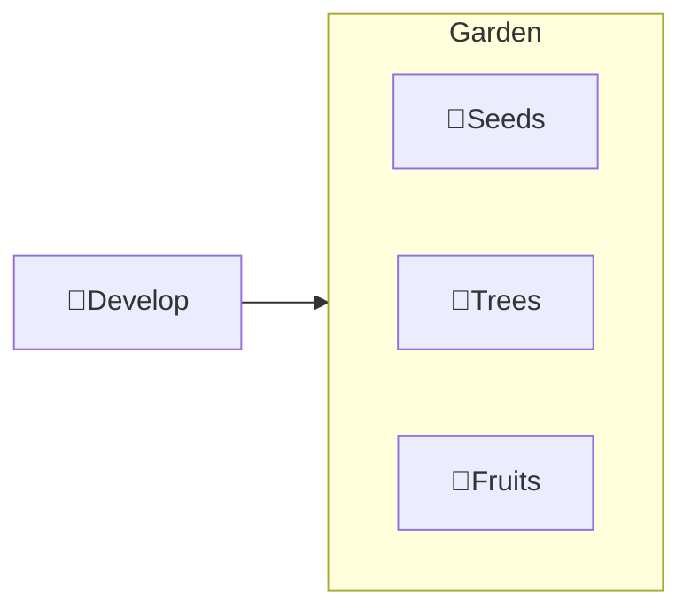

---
# configs for document itself.
title: "🎉Develop"
lastModified: "2022-12-26"

# field for querying only entry point notes.
isEntryPoint: true

# add some tags for specifying particular subjects.
tags:
  - "entrypoint"
---

```toc
style: bullet
```

# TL;DR

- you can summarize contents as a table format.
- or just write down statements you think it is important within 3 lines.

## Map of contents

- [[Develop/Seeds/🎉Seeds|🎉Seeds]]
- [[Develop/Trees/🎉Trees|🎉Trees]]
- [[Develop/Fruits/🎉Fruits|🎉Fruits]]

## My issues
- what design patterns adapated to each features.
- how to pipe logics to build features.
- challenges during implementing features.
- helpful supports deserve to remember.

## Showcases
- construct visual gallery to summarize your expriences.

## From community
- Glean tips using `mindulle-cli` for digital gardening.


