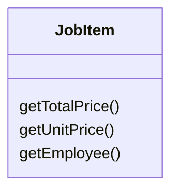
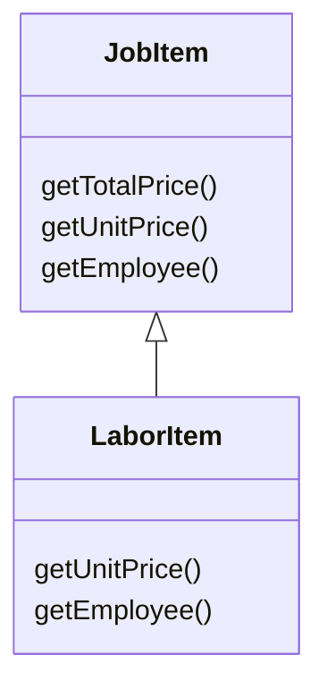

# Extract Subclass

### Problem

A class has features that are used only in certain cases.

### Solution

Create a subclass and use it in these cases.

### Why Refactor

Your main class has methods and fields for implementing a certain rare use case for the class. While the case is rare, the class is responsible for it and it would be wrong to move all the associated fields and methods to an entirely separate class. But they could be moved to a subclass, which is just what we'll do with the help of this refactoring technique.

### Benefits

-   Creates a subclass quickly and easily.

-   You can create several separate subclasses if your main class is
    currently implementing more than one such special case.

### Drawbacks

-   Despite its seeming simplicity, *Inheritance* can lead to a dead end if you have to separate several different class hierarchies. If, for example, you had the class `Dogs` with different behavior depending on the size and fur of dogs, you could tease out two hierarchies:

    -   by size: `Large`, `Medium` and `Small`

    -   by fur: `Smooth` and `Shaggy`

    And everything would seem well, except that problems will crop up as soon as you need to create a dog that's both `Large` and `Smooth`, since you can create an object from one class only. That said, you can avoid this problem by using *Compose* instead of *Inherit* (see  the [Strategy](/design-patterns/strategy) pattern). In other words, the `Dog` class will have two component fields, size and fur. You will plug in component objects from the necessary classes into these     fields. So you can create a `Dog` that has `LargeSize` and `ShaggyFur`.

### How to Refactor

1.  Create a new subclass from the class of interest.

2.  If you need additional data to create objects from a subclass,
    create a constructor and add the necessary parameters to it. Don't forget to call the constructor's parent implementation.

3.  Find all calls to the constructor of the parent class. When the
    functionality of a subclass is necessary, replace the parent constructor with the subclass constructor.

4.  Move the necessary methods and fields from the parent class to the subclass. Do this via [Push Down Method](/push-down-method) and [Push Down Field](/push-down-field). It's simpler to start by moving the methods first. This way, the fields remain accessible throughout the whole process: from the parent class prior to the move, and from the subclass itself after the move is complete.

5.  After the subclass is ready, find all the old fields that controlled
    the choice of functionality. Delete these fields by using polymorphism to replace all the operators in which the fields had
    been used. A simple example: in the Car class, you had the field
    `isElectricCar` and, depending on it, in the `refuel()` method the
    car is either fueled up with gas or charged with electricity. Post-refactoring, the `isElectricCar` field is removed and the `Car` and `ElectricCar` classes will have their own implementations of the
    `refuel()` method.
