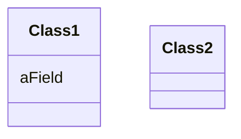
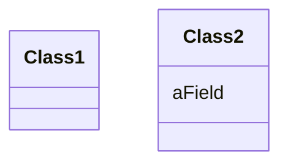

# Move Field
### Problem

A field is used more in another class than in its own class.

### Solution

Create a field in a new class and redirect all users of the old field to
it.

### Why Refactor

Often fields are moved as part of the [Extract Class](/extract-class)
technique. Deciding which class to leave the field in can be tough. Here
is our rule of thumb: **put a field in the same place as the methods
that use it** (or else where most of these methods are).

This rule will help in other cases when a field is simply located in the
wrong place.

### How to Refactor

1.  If the field is public, refactoring will be much easier if you make
    the field private and provide public access methods (for this, you
    can use [Encapsulate Field](/encapsulate-field)).

2.  Create the same field with access methods in the recipient class.

3.  Decide how you will refer to the recipient class. You may already
    have a field or method that returns the appropriate object; if not,
    you will need to write a new method or field to store the object of
    the recipient class.

4.  Replace all references to the old field with appropriate calls to
    methods in the recipient class. If the field isn't private, take
    care of this in the superclass and subclasses.

5.  Delete the field in the original class.
