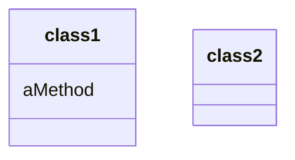
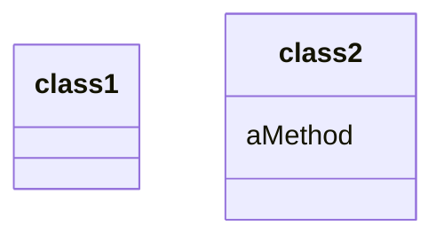

# Move Method

### Problem

A method is used more in another class than in its own class.

### Solution

Create a new method in the class that uses the method the most, then
move code from the old method to there. Turn the code of the original
method into a reference to the new method in the other class or else
remove it entirely.

### Why Refactor

1.  You want to move a method to a class that contains most of the data
    used by the method. This makes **classes more internally coherent**.

2.  You want to move a method in order to reduce or eliminate the
    dependency of the class calling the method on the class in which
    it's located. This can be useful if the calling class is already
    dependent on the class to which you're planning to move the method.
    This **reduces dependency between classes**.

### How to Refactor

1.  Verify all features used by the old method in its class. It may be a
    good idea to move them as well. As a rule, if a feature is used only
    by the method under consideration, you should certainly move the
    feature to it. If the feature is used by other methods too, you
    should move these methods as well. Sometimes it's much easier to
    move a large number of methods than to set up relationships between
    them in different classes.

    Make sure that the method isn't declared in superclasses and
    subclasses. If this is the case, you will either have to refrain
    from moving or else implement a kind of polymorphism in the
    recipient class in order to ensure varying functionality of a method
    split up among donor classes.

2.  Declare the new method in the recipient class. You may want to give
    a new name for the method that's more appropriate for it in the new
    class.

3.  Decide how you will refer to the recipient class. You may already
    have a field or method that returns an appropriate object, but if
    not, you will need to write a new method or field to store the
    object of the recipient class.

    Now you have a way to refer to the recipient object and a new method
    in its class. With all this under your belt, you can turn the old
    method into a reference to the new method.

4.  Take a look: can you delete the old method entirely? If so, place a
    reference to the new method in all places that use the old one.
