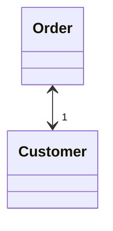
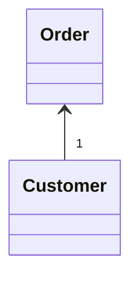

# Change Bidirectional Association to Unidirectional
### Problem

You have a bidirectional association between classes, but one of the
classes doesn't use the other's features.

### Solution

Remove the unused association.

### Why Refactor

A bidirectional association is generally harder to maintain than a
unidirectional one, requiring additional code for properly creating and deleting the relevant objects. This makes the program more complicated.

In addition, an improperly implemented bidirectional association can cause problems for garbage collection (in turn leading to memory bloat by unused objects).

Example: the garbage collector removes objects from memory that are no longer referenced by other objects. Let's say that an object pair `User`-`Order` was created, used, and then abandoned. But these objects won't be cleared from memory since they still refer to each other. That said, this problem is becoming less important thanks to advances in programming languages, which now automatically identify unused object references and remove them from memory.

There's also the problem of interdependency between classes. In a
bidirectional association, the two classes must know about each other, meaning that they can't be used separately. If many of these
associations are present, different parts of the program become too
dependent on each other and any changes in one component may affect the other components.

### Benefits

-   Simplifies the class that doesn't need the relationship. Less code
    equals less code maintenance.

-   Reduces dependency between classes. Independent classes are easier
    to maintain since any changes to a class affect only that class.

### How to Refactor

1.  Make sure that one of the following is true for your classes:

    -   No association is used.

    -   There's another way to get the associated object, such through a
        database query.

    -   The associated object can be passed as an argument to the
        methods that use it.

2.  Depending on your situation, use of a field that contains an
    association with another object should be replaced by a parameter or
    method call for getting the object in a different way.

3.  Delete the code that assigns the associated object to the field.

4.  Delete the now-unused field.
